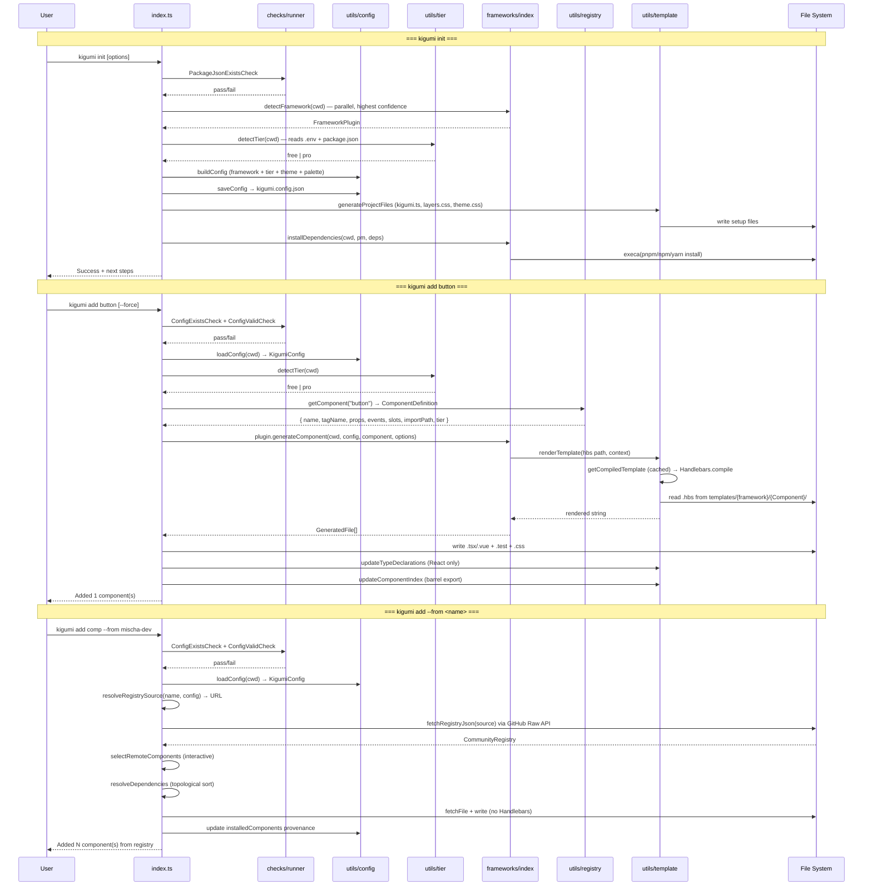
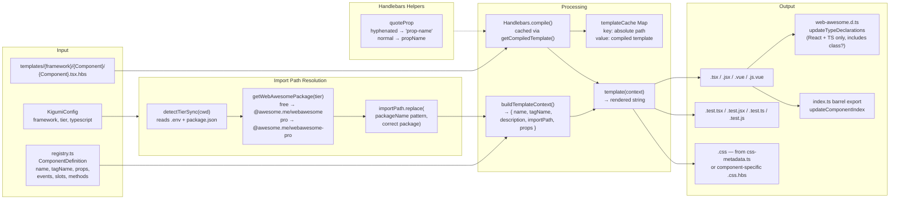
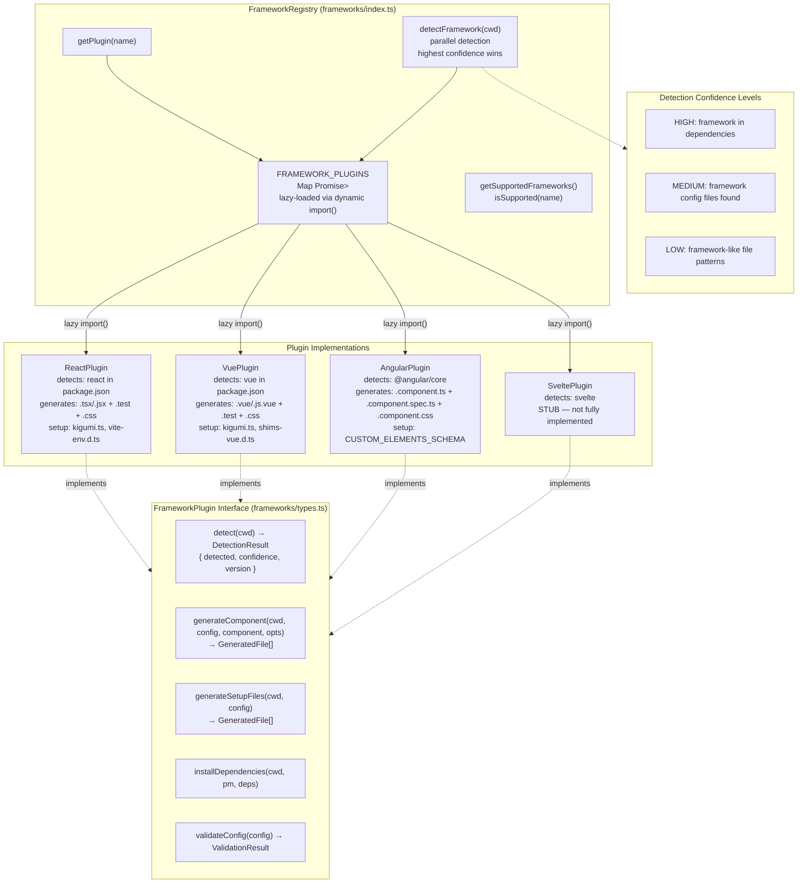
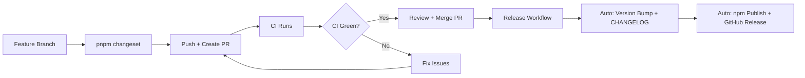

# Kigumi CLI - AI Agent Guide

> **shadcn/ui for Web Awesome** - Template-based CLI for React/Vue/Angular wrappers around Web Awesome components.

**Version**: 0.19.2 | **Stack**: TypeScript, Commander, Handlebars, Zod

## Quick Start

```bash
pnpm build              # Build CLI + copy templates
pnpm test               # Run unit tests
pnpm lint && pnpm type-check  # Verify code quality
```

**Test the CLI:**

```bash
node dist/index.js init --framework=react --theme=awesome --yes
node dist/index.js add button --force
```

## Repository Structure

| Directory         | Purpose              | Local AGENTS.md                            |
| ----------------- | -------------------- | ------------------------------------------ |
| `src/`            | CLI source code      | [src/AGENTS.md](src/AGENTS.md)             |
| `templates/`      | Handlebars templates | [templates/AGENTS.md](templates/AGENTS.md) |
| `tests/`          | Unit & E2E tests     | [tests/AGENTS.md](tests/AGENTS.md)         |
| `.claude/skills/` | AI agent skills      | -                                          |
| `dist/`           | Build output         | -                                          |

**Key Files:**
| File | Purpose |
|------|---------|
| `src/index.ts` | CLI entry point (Commander routing) |
| `src/utils/registry.ts` | Component definitions (single source of truth) |
| `src/utils/tier.ts` | Free/Pro tier detection from `package.json` + `.env` |
| `src/utils/registry-resolver.ts` | Resolves `--from` value (URL or saved registry name) |
| `src/commands/init/` | Project initialization |
| `src/commands/add/` | Component installation (built-in + community) |
| `src/commands/registry.ts` | Community registry management (connect, list, remove) |
| `src/commands/theme/install.ts` | Community theme installation from registry |
| `src/commands/theme/list.ts` | List available themes for current tier |
| `src/commands/theme/show.ts` | Show current theme details |
| `src/commands/list.ts` | List all available components (`--json` supported) |
| `src/commands/status.ts` | Project status (`--json` supported) |
| `src/commands/upgrade.ts` | Version upgrade + dependency installation |
| `src/commands/diff.ts` | Compare installed components vs current templates |
| `src/commands/update.ts` | Three-way merge update for installed components |
| `src/utils/diff-renderer.ts` | Colored unified diff output using node-diff3 diffPatch |
| `src/utils/snapshot.ts` | Snapshot CRUD for `.kigumi/snapshots/` |
| `src/utils/three-way-merge.ts` | Three-way merge logic using `node-diff3` |
| `src/utils/version-check.ts` | CLI vs project version compatibility check |
| `src/utils/version-map.ts` | Version history + breaking changes data |
| `src/utils/github-fetcher.ts` | GitHub registry fetcher (also handles local filesystem `RegistrySource` since 0.20.0) |
| `src/utils/foreign-files-staging.ts` | Stages source-framework files into `.kigumi/foreign/<slug>/` for `--cross-framework` |
| `src/schemas/community-registry.ts` | Community registry schema validation |
| `scripts/parse-custom-elements.ts` | Parse WA custom-elements.json ��� `component-metadata.ts` (events, slots, methods) |
| `scripts/generate-angular-templates.ts` | Generate Angular component templates from registry + metadata |
| `scripts/generate-react-templates.ts` | Generate React component templates from registry + metadata |
| `scripts/generate-vue-templates.ts` | Generate Vue SFC templates from registry + metadata |
| `scripts/generate-skill-references.ts` | Generate React/Vue/Angular API surface files for skills |
| `scripts/publish-skills.mjs` | Copy whitelisted skills to docs/public/ for Vercel (whitelist lives here) |
| `scripts/generate-skills-index.mjs` | Generate `.well-known/skills/index.json` from published skills |
| `scripts/post-build.ts` | Post-build tasks (copy templates to dist) |
| `scripts/post-changeset-version.ts` | Update version references after changeset version bump |
| `scripts/setup-npmrc.mjs` | Write Pro token from `.env` to `~/.npmrc` and `docs/.npmrc` |
| `scripts/validate-agents.ts` | Validate AGENTS.md facts against codebase reality |
| `scripts/validate-cem-sync.ts` | Validate CEM metadata is in sync with registry |
| `scripts/validate-changes.ts` | Validate changeset entries |
| `scripts/validate-parity.ts` | Validate React/Vue/Angular template parity |
| `scripts/validate-registry.ts` | Validate registry definitions are complete |
| `scripts/validate-templates.ts` | Validate template rendering for all components |
| `scripts/verify-test-app.ts` | Verify test app output after build |
| `scripts/storybook/overrides.ts` | Storybook story overrides |
| `scripts/storybook/patch-stories.ts` | Patch generated Storybook stories |
| `scripts/storybook/story-data.ts` | Storybook story data helpers |
| `scripts/storybook/validate-stories.ts` | Validate Storybook story structure |

---

## Skills

| Skill                        | Location                                     | Audience    | Purpose                                                                                   |
| ---------------------------- | -------------------------------------------- | ----------- | ----------------------------------------------------------------------------------------- |
| `kigumi-react`               | `.claude/skills/kigumi-react/`               | End user    | Convert WA HTML to Kigumi React JSX                                                       |
| `kigumi-vue`                 | `.claude/skills/kigumi-vue/`                 | End user    | Convert WA HTML to Kigumi Vue SFC                                                         |
| `kigumi-angular`             | `.claude/skills/kigumi-angular/`             | End user    | Convert WA HTML to Kigumi Angular                                                         |
| `kigumi-cross-framework`     | `.claude/skills/kigumi-cross-framework/`     | End user    | Convert components between React/Vue/Angular (paired with `kigumi add --cross-framework`) |
| `kigumi-compose-form`        | `.claude/skills/kigumi-compose-form/`        | End user    | Build forms with validation                                                               |
| `kigumi-compose-layout`      | `.claude/skills/kigumi-compose-layout/`      | End user    | Build page layouts, dashboards                                                            |
| `kigumi-compose-overlay`     | `.claude/skills/kigumi-compose-overlay/`     | End user    | Build dialogs, drawers, menus, toasts                                                     |
| `kigumi-compose-data`        | `.claude/skills/kigumi-compose-data/`        | End user    | Build data tables, stats, list views                                                      |
| `kigumi-theme`               | `.claude/skills/kigumi-theme/`               | End user    | Theme customization guidance                                                              |
| `generate-theme-preset`      | `.claude/skills/generate-theme-preset/`      | Contributor | Create Studio theme presets                                                               |
| `generate-component-wrapper` | `.claude/skills/generate-component-wrapper/` | Contributor | Generate React/Vue wrapper templates                                                      |
| `release`                    | `.claude/skills/release/`                    | Contributor | Prepare and publish releases                                                              |
| `kigumi-feature-spec`        | `.claude/skills/kigumi-feature-spec/`        | Contributor | Create feature specs and plans                                                            |
| `apply-theme-to-figma`       | `.claude/skills/apply-theme-to-figma/`       | Contributor | Apply CSS tokens to Figma UI Kit                                                          |

### Skills Publishing

End-user skills are published to `kigumi.style/.well-known/skills/` via Vercel. The mechanism:

1. `scripts/publish-skills.mjs` copies whitelisted skills from `.claude/skills/` into `docs/public/skills/` and `docs/public/.well-known/skills/`
2. `scripts/generate-skills-index.mjs` generates `index.json` from the copied directories
3. Internal directories (`evals/`) are excluded from the published output -- only `SKILL.md` and `references/` ship to consumers
4. Vercel serves `.well-known/skills/*` with CORS headers for cross-origin skill discovery

**When adding a new end-user skill**, add it to the `PUBLISHED_SKILLS` array in `scripts/publish-skills.mjs`. Contributor-only skills (e.g. `release`, `generate-component-wrapper`) are intentionally excluded.

---

## Critical Rules

### 1. Templates-First Development

**NEVER edit generated code. ALWAYS update `.hbs` templates.**

```
Edit .hbs → pnpm build → node dist/index.js add {component} --force → Test
```

- TypeScript: `.tsx.hbs` (with interfaces)
- JavaScript: `.jsx.hbs` (with JSDoc)
- See [templates/AGENTS.md](templates/AGENTS.md) for patterns

### 2. React Import Patterns

> **Why different?** TypeScript benefits from tree-shaking with named imports. JavaScript uses default import for broader compatibility with older bundlers.

**TypeScript (.tsx):** Use named imports

```typescript
import { forwardRef, useState, type HTMLAttributes } from 'react';
```

**JavaScript (.jsx):** Use default import + destructure

```javascript
import React from 'react';
const { useState } = React;
```

### 3. Web Components Use `class`, NOT `className`

```typescript
// Correct
<wa-button class={clsx('Button', className)}>

// Wrong - doesn't work
<wa-button className={className}>
```

### 4. TypeScript Declarations: Use `declare global`

**NEVER use `declare module 'react'`** - it overwrites React exports!

```typescript
// WRONG - breaks React
declare module 'react' {
  namespace JSX { ... }
}

// CORRECT - extends without breaking
declare global {
  namespace JSX {
    interface IntrinsicElements {
      'wa-button': React.DetailedHTMLProps<React.HTMLAttributes<HTMLElement>, HTMLElement>;
    }
  }
}
export {};
```

### 5. Event Listeners in useEffect (with cleanup)

```typescript
useEffect(() => {
  const el = ref.current;
  if (!el) return;
  el.addEventListener('wa-show', handleShow);
  return () => el.removeEventListener('wa-show', handleShow);
}, [onShow]);
```

### 6. Web Component Registration

Components must be imported in `src/lib/kigumi.ts`:

```typescript
import '@awesome.me/webawesome/dist/components/button/button.js';
```

Auto-managed by `updateKigumiImports()` in `src/commands/add/installer.ts`.

### 7. Dialog API: `requestClose()` not `hide()`

```typescript
hide: () => dialogRef.current?.requestClose(),
requestClose: () => dialogRef.current?.requestClose(),
```

### 8. Angular: `CUSTOM_ELEMENTS_SCHEMA`

Always include in `schemas` array for standalone components that use `wa-*` elements:

```typescript
@Component({
  schemas: [CUSTOM_ELEMENTS_SCHEMA],
})
```

### 9. Angular: `k-` Selector Prefix

All Kigumi Angular components use `k-` prefix (e.g., `<k-button>`, `<k-dialog>`).

### 10. Angular: Event Collision Suffixes

Native DOM events collide with Angular lifecycle methods. The `@Output()` names use suffixes:

| WA Event | Angular @Output() |
| -------- | ----------------- |
| `blur`   | `blurEvent`       |
| `focus`  | `focusEvent`      |
| `show`   | `showEvent`       |
| `input`  | `inputEvent`      |

Non-colliding events keep their base name: `wa-hide` -> `hide`, `wa-after-show` -> `afterShow`.

### 11. Angular: CVA for Form Controls

Form controls implement `ControlValueAccessor`. Use `[(ngModel)]` or `[formControl]`, never manual event wiring for value tracking.

---

## CSS Utilities

Prefer Web Awesome utility classes over custom CSS for layout and style composition:

**Layout utilities** (`.wa-` prefix — applied via `className` on plain HTML elements):
| Class | Purpose |
|-------|---------|
| `.wa-stack` | Vertical stacking with consistent gap |
| `.wa-grid` | Responsive column grid |
| `.wa-cluster` | Horizontal wrapping group (tags, chips) |
| `.wa-flank` | Sidebar + main content split |
| `.wa-frame` | Aspect-ratio constrained container |
| `.wa-split` | Two equal columns |

**Style utilities:**
| Class | Purpose |
|-------|---------|
| `.wa-dark` | Applies dark color scheme to a subtree |

Reference: https://webawesome.com/docs/utilities/ and https://webawesome.com/docs/layout/

---

## Tier System

**Single source of truth:** `package.json` determines tier (with token fallback), NOT config.

| Tier | Detection                                    | Package                      | Themes    |
| ---- | -------------------------------------------- | ---------------------------- | --------- |
| Free | `@awesome.me/webawesome` in package.json     | `@awesome.me/webawesome`     | 3 themes  |
| Pro  | `@awesome.me/webawesome-pro` in package.json | `@awesome.me/webawesome-pro` | 11 themes |

**Pro-only components:** chart, bar-chart, line-chart, bubble-chart, doughnut-chart, pie-chart, polar-area-chart, radar-chart, scatter-chart, combobox, file-input, number-input, sparkline, toast, toast-item

### Tier Detection Logic

```typescript
// src/utils/tier.ts - Detects tier with package.json priority
async function detectTier(cwd: string): Promise<Tier> {
  // 1. Check package.json first (installed package is source of truth)
  const pkg = await fs.readJSON('package.json');
  if (pkg.dependencies?.['@awesome.me/webawesome-pro']) return 'pro';
  if (pkg.dependencies?.['@awesome.me/webawesome']) return 'free';

  // 2. Fallback to token detection (.env or ~/.npmrc)
  const token = await detectProToken(cwd);
  return token ? 'pro' : 'free';
}
```

**Detection priority:**

1. `package.json` dependencies (highest priority - actual installed package)
2. Environment variable `$WEBAWESOME_NPM_TOKEN` (CI/CD)
3. Global `~/.npmrc` token (set via `pnpm run setup:npmrc`)
4. Project `.env` file (`WEBAWESOME_NPM_TOKEN`)
5. Default to `free` if none found

**Token Setup (Architecture):**

The repository includes `scripts/setup-npmrc.mjs` which reads tokens from `.env` files
and writes them to:

- Global `~/.npmrc` (for npm/yarn)
- `docs/.npmrc` (gitignored) - **required for pnpm**, which does not use global auth for scoped registries

```bash
# Setup token (after clone, or when .env changes)
pnpm run setup:npmrc
```

This approach:

- Works with npm, pnpm, AND yarn
- Supports different tokens per machine (reads from `docs/.env` or root `.env`)
- `docs/.npmrc` is gitignored and generated from `.env` (token never committed)

**docs/ vs. User Projects:**

| Context           | `.npmrc` location | Token source                                       |
| ----------------- | ----------------- | -------------------------------------------------- |
| User project      | Project root      | Registry URL only; token from global or `.env`     |
| docs/ (this repo) | `docs/.npmrc`     | Gitignored; generated by `setup:npmrc` from `.env` |

User projects get `.npmrc` with registry URL only via `kigumi init`. The docs app needs the token in its project `.npmrc` because pnpm does not use global auth for scoped registries.

### Migration Triggers

| Previous | New  | Action                                     |
| -------- | ---- | ------------------------------------------ |
| free     | pro  | Migrate imports to `-pro`, update `.npmrc` |
| pro      | free | Reverse migrate imports, update `.npmrc`   |

**Critical files:** `src/commands/init/migration.ts`, `src/commands/init/installer.ts`

---

## Code Quality (Zero Tolerance)

Pre-commit hooks enforce all checks. **All must pass before commit:**

```bash
pnpm lint          # ESLint: 0 problems
pnpm type-check    # TypeScript: 0 errors
pnpm format:check  # Prettier: all formatted
pnpm test          # Vitest: all passing
```

**Auto-fix:** `pnpm lint:fix && pnpm format`

---

## Architecture

### Module Boundaries

| Layer    | Directory       | Responsibility                          |
| -------- | --------------- | --------------------------------------- |
| Entry    | `src/index.ts`  | CLI routing, error handling             |
| Commands | `src/commands/` | User-facing operations                  |
| Utils    | `src/utils/`    | Business logic (registry, tier, config) |
| Schemas  | `src/schemas/`  | Zod validation                          |
| Errors   | `src/errors/`   | Typed error classes                     |
| Output   | `src/output/`   | Console formatting (@clack/prompts)     |

### Module Dependency Graph

```mermaid
flowchart TD
    subgraph Entry["CLI Entry"]
        CLI["src/index.ts\nCommander routing"]
    end

    subgraph Commands["commands/"]
        init["init/\nconfig-builder, file-generator\nmigration, installer"]
        add["add/\ncomponent-selector, validator\ninstaller, remote-installer"]
        theme["theme/\nset, install"]
        doctor["doctor.ts"]
        brand["brand.ts"]
        palette["palette.ts"]
        list["list.ts"]
        status["status.ts"]
        registry_cmd["registry/\ninit, validate, connect\nlist, remove"]
        upgrade["upgrade.ts"]
        diff["diff.ts"]
        update["update.ts"]
    end

    subgraph Frameworks["frameworks/"]
        FW_INDEX["index.ts\nFrameworkRegistry\nlazy-loaded Map"]
        react["react/ReactPlugin"]
        vue["vue/VuePlugin"]
        angular["angular/AngularPlugin"]
        svelte["svelte/SveltePlugin (stub)"]
    end

    subgraph Utils["utils/"]
        registry["registry.ts\n74 ComponentDefinitions\nprops, events, slots, methods"]
        template["template.ts\nHandlebars compile + cache\nquoteProp helper"]
        tier["tier.ts\nFree/Pro detection\ndetectTier, detectTierSync"]
        config["config.ts\ncosmiconfig loader\nloadConfig, saveConfig, getConfig"]
        css_meta["css-metadata.ts"]
        detect_fw["detect-framework.ts\ngetProjectInfo"]
        token_mgr["token-manager.ts"]
        regenerate["regenerate.ts"]
        snapshot["snapshot.ts\n.kigumi/snapshots/ CRUD"]
        merge["three-way-merge.ts\nnode-diff3 merge logic"]
        github_fetcher["github-fetcher.ts\nURL parsing, raw fetch"]
        github_token["github-token.ts\nPAT resolution"]
        registry_cache["registry-cache.ts\nDisk cache with TTL"]
        registry_resolver["registry-resolver.ts\nresolveRegistrySource()"]
        version_check["version-check.ts\ncheckVersionCompatibility()"]
        version_map["version-map.ts\nVERSION_MAP, breaking changes"]
    end

    subgraph Schemas["schemas/"]
        schema_config["config.ts — Zod KigumiConfig"]
        schema_options["options.ts — Zod command options"]
        schema_tier["tier.ts — Zod tier types"]
        schema_community["community-registry.ts\nZod registry schema"]
    end

    subgraph Errors["errors/"]
        err_base["base.ts — KigumiError"]
        err_config["config.ts"]
        err_fs["filesystem.ts"]
        err_net["network.ts"]
        err_community["community-registry.ts"]
        err_version["version.ts\nVersionMismatchError"]
    end

    subgraph Checks["checks/"]
        check_runner["runner.ts — CheckRunner"]
        check_config["config-checks.ts"]
        check_deps["dependency-checks.ts"]
    end

    subgraph Templates["templates/"]
        tpl_react["react/ — 74 components\n.tsx.hbs, .jsx.hbs\n.test.tsx.hbs, .test.jsx.hbs, .css.hbs"]
        tpl_vue["vue/ — 74 components\n.vue.hbs, .js.vue.hbs\n.test.ts.hbs, .test.js.hbs, .css.hbs"]
        tpl_angular["angular/ — 74 components\n.component.ts.hbs, .component.spec.ts.hbs, .component.css.hbs"]
    end

    CLI --> Commands
    init --> FW_INDEX
    init --> config
    init --> tier
    init --> template
    init --> detect_fw
    add --> FW_INDEX
    add --> registry
    add --> tier
    add --> template
    add --> check_runner
    add --> github_fetcher
    add --> schema_community
    add --> registry_resolver
    theme --> config
    theme --> registry_resolver
    registry_cmd --> config
    registry_cmd --> github_fetcher
    doctor --> config
    doctor --> tier
    doctor --> constants
    upgrade --> config
    upgrade --> version_map
    diff --> config
    diff --> template
    diff --> registry
    diff --> snapshot
    update --> config
    update --> template
    update --> registry
    update --> snapshot
    update --> merge
    add --> snapshot
    add --> version_check

    FW_INDEX --> react & vue & angular & svelte
    react --> template
    vue --> template
    angular --> template
    template --> tpl_react & tpl_vue & tpl_angular
    template --> registry
    template --> css_meta

    github_fetcher --> github_token
    github_fetcher --> registry_cache

    config --> schema_config
    add --> schema_options
    tier --> schema_tier
    check_runner --> check_config & check_deps
    Commands --> Errors
```



### Command Flows



### Template Pipeline



### Framework Plugin System



---

## Debugging

| Problem             | Check                       | Fix                                                                            |
| ------------------- | --------------------------- | ------------------------------------------------------------------------------ |
| Components unstyled | `kigumi.ts` imports?        | Run `updateKigumiImports()`                                                    |
| TypeScript errors   | `declare module 'react'`?   | Use `declare global` instead                                                   |
| wa-\* type errors   | `vite-env.d.ts` exists?     | Run `generateViteEnvDts()`                                                     |
| Theme not applying  | CSS imported? HTML classes? | Check `kigumi.ts` imports                                                      |
| Theme conflicts     | Duplicate theme imports?    | Verify `theme.css` has no `@import`                                            |
| Tier wrong          | `.env` has token?           | Use `detectTier()`                                                             |
| Free→Pro fails      | Migration ran?              | Check `migration.ts`                                                           |
| Wrong import paths  | Mixed free/pro imports?     | Run `kigumi doctor`                                                            |
| Stale WA version    | Config or package outdated? | Run `kigumi doctor`                                                            |
| Version mismatch    | `kigumiVersion` in config?  | Run `kigumi upgrade`                                                           |
| JSON parse fails    | File has comments?          | Use `readJSONWithComments()`                                                   |
| 401 in docs/        | `docs/.npmrc` present?      | Run `pnpm run setup:npmrc`                                                     |
| Broken error URLs   | `https://https://` prefix?  | Use constants from `src/constants.ts` (`GITHUB_ISSUES_URL`, `GITHUB_REPO_URL`) |
| Unhandled error     | `catch {}` swallows error?  | Always capture: `catch (_error) {}` with descriptive comment                   |
| Config validation   | Generic `Error` thrown?     | Use `ConfigInvalidError` from `src/errors/config.ts`                           |

---

## Common Mistakes

1. Editing generated code instead of `.hbs` templates
2. Using `className` on `<wa-*>` elements (use `class`)
3. Using `declare module 'react'` (use `declare global`)
4. Event listeners in ref callback (use `useEffect`)
5. Using `fs.readJSON()` on files with comments
6. Storing tier in config (detect from `.env`)
7. Using `any` type (use `unknown` or proper types)
8. **Using `!important` to override Web Awesome styles** (use CSS layers - `theme.css` automatically overrides base)
9. **Manually editing `layers.css` or `kigumi.ts`** (auto-generated - use `kigumi theme` commands)
10. **Adding Web Awesome imports to `theme.css`** (all imports handled in `layers.css`)
11. Making assumptions - ask for help if unsure
12. **Manually editing community registry files** instead of using `kigumi registry` commands
13. **Importing `KigumiConfig` from `utils/config.ts`** (old interface, incomplete) — use `schemas/config.ts` (Zod-inferred, has `registries`, `installedThemes`, etc.)
14. **Hardcoding GitHub URLs** — use `GITHUB_ISSUES_URL` / `GITHUB_REPO_URL` from `src/constants.ts`
15. **Silent `catch {}` blocks** — always capture the error variable (`catch (_error)`) and add a descriptive comment explaining why it's intentionally ignored
16. **Using `process.exit()` in commands** — use `handleError(error, output)` from `src/errors/index.ts` for consistent error reporting

---

## Auto-Generated Files

| File                                | Purpose                                                  | Regenerated When              | User-Editable      |
| ----------------------------------- | -------------------------------------------------------- | ----------------------------- | ------------------ |
| `src/lib/kigumi.ts`                 | Imports layers.css and applies theme classes to `<html>` | Theme/brand/palette commands  | ❌ No              |
| `src/styles/layers.css`             | Wraps Web Awesome CSS in cascade layers                  | Theme/brand/palette commands  | ❌ No              |
| `src/styles/theme.css`              | User custom CSS overrides                                | Only on init (if missing)     | ✅ Yes - preserved |
| `src/types/web-awesome.d.ts`        | TypeScript declarations for wa-\* elements (incl. class) | `kigumi add` (React + TS)     | ❌ No              |
| `src/styles/community-themes/*.css` | Downloaded community theme CSS                           | `kigumi theme install --from` | ❌ No              |
| `.npmrc` (user project)             | Registry URL only (no token)                             | Only on init                  | ❌ No              |
| `docs/.npmrc`                       | Registry + token (gitignored)                            | `pnpm run setup:npmrc`        | ❌ No              |

**Key Points:**

- `layers.css` uses CSS `@layer` for cascade control (base < theme)
- `layers.css` distinguishes built-in themes (from WA package) vs community themes (from `community-themes/` dir)
- `theme.css` is preserved on re-init - existing user styles won't be overwritten
- Theme/brand commands regenerate `kigumi.ts` + `layers.css` but preserve `theme.css`
- Type declarations include `class?: string` on all `wa-*` elements (web components use `class`, not `className`)

---

## Decision Trees & Checklists

### Decision Tree: Component Task Type

```
START: User requests component change
│
├─ "Add new component"
│  ├─ Check: Component in registry? → NO
│  │  └─ ACTION: Use generate-webawesome-component skill
│  │     └─ Creates templates → registry entry → tests
│  │
│  └─ Check: Component in registry? → YES
│     └─ ACTION: User wants to install it
│        └─ Run: `kigumi add <component>`
│
├─ "Fix/improve existing component"
│  ├─ Check: Issue in generated code?
│  │  └─ ACTION: Edit .hbs template
│  │     └─ Path: templates/{framework}/{ComponentName}/
│  │     └─ Rebuild: pnpm build
│  │     └─ Test: node dist/index.js add {component} --force
│  │
│  └─ Check: Issue in CLI logic?
│     └─ ACTION: Edit src/ files
│        └─ Commands: src/commands/
│        └─ Utils: src/utils/
│        └─ Test: pnpm test
│
└─ "Update component metadata"
   └─ ACTION: Edit src/utils/registry.ts
      └─ Update: name, tagName, importPath, tier, category, description, props
      └─ Validate: pnpm validate:registry
      └─ Test: pnpm test
```

### Decision Tree: Tier-Related Changes

```
START: Change affects tier detection or packages
│
├─ "Detect tier for project"
│  ├─ Priority 1: Check package.json dependencies
│  │  └─ @awesome.me/webawesome-pro → pro tier
│  │  └─ @awesome.me/webawesome → free tier
│  │
│  ├─ Priority 2: Check .env for WEBAWESOME_NPM_TOKEN
│  │  └─ Token present → pro tier
│  │
│  └─ Priority 3: Check ~/.npmrc for global token
│     └─ Token present → pro tier
│     └─ No token → free tier (default)
│
├─ "Change tier logic"
│  └─ ACTION: ONLY edit src/utils/tier.ts
│     └─ Functions: detectTier(), detectTierSync(), getWebAwesomePackage()
│     └─ Test: tests/unit/tier.test.ts
│
└─ "Add tier-restricted component"
   └─ ACTION: Edit src/utils/registry.ts
      └─ Set tier: 'pro' or 'free'
      └─ Validator: src/commands/add/validator.ts checks tier
      └─ Test: Add TierRestrictionError test
```

### Checklist: Before Committing Template Changes

- [ ] **Edited .hbs file (not generated code)**
  - Path: `templates/{framework}/{ComponentName}/*.hbs`
  - Both frameworks: React AND Vue
  - Both variants: TypeScript AND JavaScript

- [ ] **Rebuilt CLI**
  - `pnpm build` (compiles + copies templates)
  - Check: `dist/templates/` updated

- [ ] **Generated & tested component**
  - `node dist/index.js add {component} --force`
  - Visual check: Component renders correctly
  - Browser test: Events work, styles apply

- [ ] **Verified template syntax**
  - Handlebars: `{{variable}}`, `{{#if}}`, `{{#each}}`
  - Props: Use `quoteProp` helper for keys with dashes
  - React: `class` not `className` for `<wa-*>`
  - TypeScript: Named imports, interfaces
  - JavaScript: Default import, JSDoc

- [ ] **Updated tests**
  - Unit: Template rendering test
  - Integration: Compile-check test
  - Snapshot: Visual regression (if applicable)

### Checklist: Before Adding New Component

- [ ] **Component documentation ready**
  - Web Awesome docs URL
  - Component tag name (e.g., `wa-button`)
  - Import path pattern
  - Props list with types and defaults

- [ ] **Registry entry complete**
  - Name (PascalCase)
  - tagName (kebab-case, starts with `wa-`)
  - importPath (@awesome.me/webawesome/...)
  - tier ('free' or 'pro')
  - category (matches existing categories)
  - description (concise, user-facing)
  - props (array of objects with name, type, default, description)

- [ ] **Templates created (both frameworks)**
  - `templates/react/{ComponentName}/{ComponentName}.tsx.hbs`
  - `templates/react/{ComponentName}/{ComponentName}.jsx.hbs`
  - `templates/react/{ComponentName}/{ComponentName}.test.tsx.hbs`
  - `templates/react/{ComponentName}/{ComponentName}.test.jsx.hbs`
  - `templates/react/{ComponentName}/{ComponentName}.css.hbs`
  - `templates/vue/{ComponentName}/{ComponentName}.vue.hbs`
  - `templates/vue/{ComponentName}/{ComponentName}.js.vue.hbs`
  - `templates/vue/{ComponentName}/{ComponentName}.test.ts.hbs`
  - `templates/vue/{ComponentName}/{ComponentName}.test.js.hbs`
  - `templates/vue/{ComponentName}/{ComponentName}.css.hbs`

- [ ] **Validation passed**
  - `pnpm validate:registry` → ✅
  - `pnpm validate:templates` → ✅
  - `pnpm test` → ✅

### Checklist: Before Merging PR

- [ ] **All tests pass**
  - Unit tests: `pnpm test`
  - Integration tests: `pnpm test:integration`
  - Linting: `pnpm lint`
  - Type-check: `pnpm type-check`

- [ ] **Validation scripts pass**
  - Registry: `pnpm validate:registry`
  - Templates: `pnpm validate:templates`
  - Changes: `pnpm validate:changes`

- [ ] **CI pipeline green**
  - Lint & Format job
  - Test job (Node 18, 20, 22)
  - Integration Tests job
  - Coverage job (>=63%)
  - TypeScript Check job
  - Validate Registry & Templates job
  - License Check job
  - Security Audit job
  - Chromatic visual regression job

- [ ] **Documentation updated**
  - CHANGELOG.md (if user-facing)
  - README.md (if CLI changes)
  - AGENTS.md (if workflow changes)

- [ ] **No regressions**
  - Existing components still generate
  - Existing tests still pass
  - No tier logic broken

### Checklist: Debugging Failed Generation

- [ ] **Check template syntax**
  - Run: `pnpm validate:templates`
  - Look for: Missing .hbs files, syntax errors

- [ ] **Check registry consistency**
  - Run: `pnpm validate:registry`
  - Look for: Wrong paths, missing props, duplicates

- [ ] **Check tier detection**
  - Run: `pnpm run doctor`
  - Look for: Wrong package imports (free vs pro)

- [ ] **Check TypeScript compilation**
  - Test: Run compile-check integration test
  - Look for: Type errors in generated code

- [ ] **Check runtime errors**
  - Start dev server with generated component
  - Open browser console
  - Look for: Import errors, undefined references

---

## Questions Before Changes

1. Does this need `.hbs` template changes?
2. Works with React 18 AND 19?
3. Tier restrictions correct?
4. TypeScript errors for users?
5. Web components need imports?
6. Event listeners cleaned up?
7. Tested in browser?

---

## Release Workflow

> **For AI Agents:** This section documents the release process. Follow these steps strictly for consistency.

### Overview

Fully automated release pipeline: **merge PR to main = release** (when changesets exist).



**Control points:**

- Review PR before merge (full control over what ships)
- CI must pass before merge (quality gate)
- No manual steps after merge (fully automated)

### Developer Workflow

**Step 1: Create feature branch and make changes**

```bash
git checkout -b feat/my-feature
# ... make changes ...
git add .
git commit -m "feat: add new component"
```

Rules:

- Use conventional commit messages (feat/fix/docs/chore/refactor)
- **NEVER** use `--amend` on pushed commits
- **NEVER** rebase after pushing

**Step 2: Create changeset (if user-facing)**

| Change Type           | Changeset? | Severity | Examples                   |
| --------------------- | ---------- | -------- | -------------------------- |
| New component         | Yes        | `minor`  | Add Dialog component       |
| New CLI command       | Yes        | `minor`  | Add `kigumi theme` command |
| Bug fix (user-facing) | Yes        | `patch`  | Fix Button event handler   |
| Breaking change       | Yes        | `major`  | Remove deprecated prop     |
| Docs only             | No         | -        | Update README              |
| Tests only            | No         | -        | Add unit tests             |
| Refactor (internal)   | No         | -        | Reorganize utils           |
| CI/Build changes      | No         | -        | Update GitHub Actions      |

```bash
pnpm changeset
# Select patch/minor/major, write user-facing summary
git add .changeset/*.md
git commit -m "chore: add changeset"
```

**Step 3: Push and create PR**

```bash
git push -u origin HEAD
gh pr create --title "feat: my feature" --body "Description..."
```

**Step 4: Wait for CI, review, merge**

All checks must pass before merge:

- Lint & Format
- Test (Node 18, 20, 22)
- Integration Tests
- Coverage (>=63%)
- TypeScript Check
- Validate Registry & Templates
- License Check
- Security Audit
- Chromatic (visual regression)

Once CI passes and review is approved, merge via GitHub UI (squash or merge commit, no rebase).

### What Happens After Merge (Fully Automated)

1. **Release workflow** (`.github/workflows/release.yml`) triggers on push to main
2. **CI runs** again via reusable workflow (`.github/workflows/ci.yml`)
3. **If changesets exist:**
   - `changeset version` bumps `package.json` and updates `CHANGELOG.md`
   - `pnpm build && changeset publish` builds and publishes to npm
   - GitHub Release with git tag is created automatically
4. **If no changesets:** Nothing happens (no release)

### Manual Release (Emergency Only)

If automation fails:

```bash
pnpm changeset version
pnpm release
```

**NEVER do this** unless automation is broken. Document reason in a follow-up PR.

### Branch Protection

**main** branch is protected:

- Require PR before merging
- Require CI status checks (all jobs must pass)
- Require conversation resolution
- No force push allowed
- No direct commits

### Troubleshooting

| Problem                | Solution                                          |
| ---------------------- | ------------------------------------------------- |
| CI fails on main       | Fix in new PR, do not force push                  |
| Release workflow fails | Check NPM_TOKEN secret in GitHub                  |
| No release after merge | Ensure `.changeset/*.md` files were in the PR     |
| Publish fails          | Verify package.json version not already published |
| Wrong version bumped   | Recreate changeset with correct severity          |

### Quick Reference

```bash
# Create changeset (user-facing changes only)
pnpm changeset

# Check what will be released
pnpm changeset status

# Local test before merge
pnpm build && pnpm test && pnpm lint && pnpm type-check

# View CI status
gh pr checks
```

---

## Related Documentation

- **Critical rules:** [CLAUDE.md](CLAUDE.md) - Always-in-context rules for Claude Code
- **Templates:** [templates/AGENTS.md](templates/AGENTS.md) - Component generation patterns
- **Source:** [src/AGENTS.md](src/AGENTS.md) - Code architecture details
- **Tests:** [tests/AGENTS.md](tests/AGENTS.md) - Testing guidelines
- **Kigumi Studio:** [docs/src/kigumi-studio/AGENTS.md](docs/src/kigumi-studio/AGENTS.md) - Visual theme builder

---

**Maintained by:** AI Assistants | **Last Updated:** 2026-04-08
