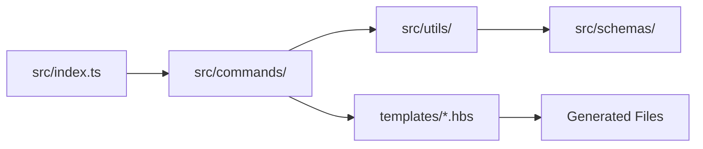
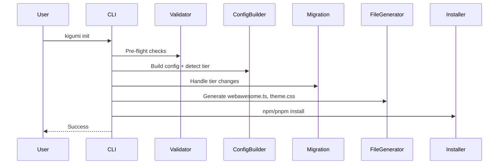
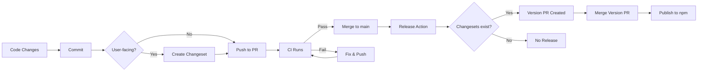

# Kigumi CLI - AI Agent Guide

> **shadcn/ui for Web Awesome** - Template-based CLI for React/Vue/Svelte wrappers around Web Awesome components.

**Version**: 0.2.0 | **Stack**: TypeScript, Commander, Handlebars, Zod

## Quick Start

```bash
pnpm build              # Build CLI + copy templates
pnpm test               # Run unit tests
pnpm lint && pnpm type-check  # Verify code quality
```

**Test the CLI:**

```bash
node dist/index.js init --framework=react --theme=awesome --yes
node dist/index.js add button --overwrite
```

## Repository Structure

See [repo-structure.mmd](repo-structure.mmd) for visual diagram.

| Directory    | Purpose              | Local AGENTS.md                            |
| ------------ | -------------------- | ------------------------------------------ |
| `src/`       | CLI source code      | [src/AGENTS.md](src/AGENTS.md)             |
| `templates/` | Handlebars templates | [templates/AGENTS.md](templates/AGENTS.md) |
| `tests/`     | Unit & E2E tests     | [tests/AGENTS.md](tests/AGENTS.md)         |
| `dist/`      | Build output         | -                                          |

**Key Files:**
| File | Purpose |
|------|---------|
| `src/index.ts` | CLI entry point (Commander routing) |
| `src/utils/registry.ts` | Component definitions (single source of truth) |
| `src/utils/tier.ts` | Free/Pro tier detection from `package.json` + `.env` |
| `src/commands/init/` | Project initialization |
| `src/commands/add.ts` | Component installation |

---

## Critical Rules

### 1. Templates-First Development

**NEVER edit generated code. ALWAYS update `.hbs` templates.**

```
Edit .hbs → pnpm build → node dist/index.js add {component} --overwrite → Test
```

- TypeScript: `.tsx.hbs` (with interfaces)
- JavaScript: `.jsx.hbs` (with JSDoc)
- See [templates/AGENTS.md](templates/AGENTS.md) for patterns

### 2. React Import Patterns

> **Why different?** TypeScript benefits from tree-shaking with named imports. JavaScript uses default import for broader compatibility with older bundlers.

**TypeScript (.tsx):** Use named imports

```typescript
import { forwardRef, useState, type HTMLAttributes } from 'react';
```

**JavaScript (.jsx):** Use default import + destructure

```javascript
import React from 'react';
const { useState } = React;
```

### 3. Web Components Use `class`, NOT `className`

```typescript
// Correct
<wa-button class={clsx('Button', className)}>

// Wrong - doesn't work
<wa-button className={className}>
```

### 4. TypeScript Declarations: Use `declare global`

**NEVER use `declare module 'react'`** - it overwrites React exports!

```typescript
// WRONG - breaks React
declare module 'react' {
  namespace JSX { ... }
}

// CORRECT - extends without breaking
declare global {
  namespace JSX {
    interface IntrinsicElements {
      'wa-button': React.DetailedHTMLProps<React.HTMLAttributes<HTMLElement>, HTMLElement>;
    }
  }
}
export {};
```

### 5. Event Listeners in useEffect (with cleanup)

```typescript
useEffect(() => {
  const el = ref.current;
  if (!el) return;
  el.addEventListener('wa-show', handleShow);
  return () => el.removeEventListener('wa-show', handleShow);
}, [onShow]);
```

### 6. Web Component Registration

Components must be imported in `src/lib/webawesome.ts`:

```typescript
import '@awesome.me/webawesome/dist/components/button/button.js';
```

Auto-managed by `updateWebAwesomeImports()` in `src/commands/add.ts`.

### 7. Dialog API: `requestClose()` not `hide()`

```typescript
hide: () => dialogRef.current?.requestClose(),
requestClose: () => dialogRef.current?.requestClose(),
```

---

## Tier System

**Single source of truth:** `.env` file determines tier, NOT config.

| Tier | Detection                        | Package                      | Themes    |
| ---- | -------------------------------- | ---------------------------- | --------- |
| Free | No token in `.env`               | `@awesome.me/webawesome`     | 3 themes  |
| Pro  | `WEBAWESOME_NPM_TOKEN` in `.env` | `@awesome.me/webawesome-pro` | 11 themes |

**Pro-only components:** page, charts, combobox, data-grid, date-picker, file-input, toast, video

### Tier Detection Logic

```typescript
// src/utils/tier.ts - Detects tier with package.json priority
async function detectTier(cwd: string): Promise<Tier> {
  // 1. Check package.json first (installed package is source of truth)
  const pkg = await fs.readJSON('package.json');
  if (pkg.dependencies?.['@awesome.me/webawesome-pro']) return 'pro';
  if (pkg.dependencies?.['@awesome.me/webawesome']) return 'free';

  // 2. Fallback to token detection (.env or ~/.npmrc)
  const token = await detectProToken(cwd);
  return token ? 'pro' : 'free';
}
```

**Detection priority:**

1. `package.json` dependencies (highest priority - actual installed package)
2. `.env` file (`WEBAWESOME_NPM_TOKEN`)
3. Global `~/.npmrc` token
4. Default to `free` if none found

### Migration Triggers

| Previous | New  | Action                                     |
| -------- | ---- | ------------------------------------------ |
| free     | pro  | Migrate imports to `-pro`, update `.npmrc` |
| pro      | free | Reverse migrate imports, update `.npmrc`   |

**Critical files:** `src/commands/init/migration.ts`, `src/commands/init/installer.ts`

---

## Code Quality (Zero Tolerance)

Pre-commit hooks enforce all checks. **All must pass before commit:**

```bash
pnpm lint          # ESLint: 0 problems
pnpm type-check    # TypeScript: 0 errors
pnpm format:check  # Prettier: all formatted
pnpm test          # Vitest: all passing
```

**Auto-fix:** `pnpm lint:fix && pnpm format`

---

## Architecture

### Data Flow



### Module Boundaries

| Layer    | Directory       | Responsibility                          |
| -------- | --------------- | --------------------------------------- |
| Entry    | `src/index.ts`  | CLI routing, error handling             |
| Commands | `src/commands/` | User-facing operations                  |
| Utils    | `src/utils/`    | Business logic (registry, tier, config) |
| Schemas  | `src/schemas/`  | Zod validation                          |
| Errors   | `src/errors/`   | Typed error classes                     |
| Output   | `src/output/`   | Console formatting (@clack/prompts)     |

### Init Command Flow



---

## Debugging

| Problem             | Check                       | Fix                                 |
| ------------------- | --------------------------- | ----------------------------------- |
| Components unstyled | `webawesome.ts` imports?    | Run `updateWebAwesomeImports()`     |
| TypeScript errors   | `declare module 'react'`?   | Use `declare global` instead        |
| wa-\* type errors   | `vite-env.d.ts` exists?     | Run `generateViteEnvDts()`          |
| Theme not applying  | CSS imported? HTML classes? | Check `webawesome.ts` imports       |
| Theme conflicts     | Duplicate theme imports?    | Verify `theme.css` has no `@import` |
| Tier wrong          | `.env` has token?           | Use `detectTier()`                  |
| Free→Pro fails      | Migration ran?              | Check `migration.ts`                |
| Wrong import paths  | Mixed free/pro imports?     | Run `kigumi doctor`                 |
| JSON parse fails    | File has comments?          | Use `readJSONWithComments()`        |

---

## Common Mistakes

1. Editing generated code instead of `.hbs` templates
2. Using `className` on `<wa-*>` elements (use `class`)
3. Using `declare module 'react'` (use `declare global`)
4. Event listeners in ref callback (use `useEffect`)
5. Using `fs.readJSON()` on files with comments
6. Storing tier in config (detect from `.env`)
7. Using `any` type (use `unknown` or proper types)
8. **Using `!important` to override Web Awesome styles** (use CSS layers - `theme.css` automatically overrides base)
9. **Manually editing `layers.css` or `webawesome.ts`** (auto-generated - use `kigumi theme` commands)
10. **Adding Web Awesome imports to `theme.css`** (all imports handled in `layers.css`)
11. Making assumptions - ask for help if unsure

---

## Auto-Generated Files

| File                    | Purpose                                                  | Regenerated When             | User-Editable      |
| ----------------------- | -------------------------------------------------------- | ---------------------------- | ------------------ |
| `src/lib/webawesome.ts` | Imports layers.css and applies theme classes to `<html>` | Theme/brand/palette commands | ❌ No              |
| `src/styles/layers.css` | Wraps Web Awesome CSS in cascade layers                  | Theme/brand/palette commands | ❌ No              |
| `src/styles/theme.css`  | User custom CSS overrides                                | Only on init (if missing)    | ✅ Yes - preserved |
| `src/vite-env.d.ts`     | TypeScript declarations for wa-\* elements               | Only on init                 | ❌ No              |
| `.npmrc`                | npm registry configuration                               | Init + tier changes          | ❌ No              |

**Key Points:**

- `layers.css` uses CSS `@layer` for cascade control (base < theme)
- `theme.css` is preserved on re-init - existing user styles won't be overwritten
- Theme/brand commands regenerate `webawesome.ts` + `layers.css` but preserve `theme.css`

---

## Decision Trees & Checklists

### Decision Tree: Component Task Type

```
START: User requests component change
│
├─ "Add new component"
│  ├─ Check: Component in registry? → NO
│  │  └─ ACTION: Use generate-webawesome-component skill
│  │     └─ Creates templates → registry entry → tests
│  │
│  └─ Check: Component in registry? → YES
│     └─ ACTION: User wants to install it
│        └─ Run: `kigumi add <component>`
│
├─ "Fix/improve existing component"
│  ├─ Check: Issue in generated code?
│  │  └─ ACTION: Edit .hbs template
│  │     └─ Path: templates/{framework}/{ComponentName}/
│  │     └─ Rebuild: pnpm build
│  │     └─ Test: node dist/index.js add {component} --overwrite
│  │
│  └─ Check: Issue in CLI logic?
│     └─ ACTION: Edit src/ files
│        └─ Commands: src/commands/
│        └─ Utils: src/utils/
│        └─ Test: pnpm test
│
└─ "Update component metadata"
   └─ ACTION: Edit src/utils/registry.ts
      └─ Update: name, tagName, importPath, tier, category, description, props
      └─ Validate: pnpm validate:registry
      └─ Test: pnpm test
```

### Decision Tree: Tier-Related Changes

```
START: Change affects tier detection or packages
│
├─ "Detect tier for project"
│  ├─ Priority 1: Check package.json dependencies
│  │  └─ @awesome.me/webawesome-pro → pro tier
│  │  └─ @awesome.me/webawesome → free tier
│  │
│  ├─ Priority 2: Check .env for WEBAWESOME_NPM_TOKEN
│  │  └─ Token present → pro tier
│  │
│  └─ Priority 3: Check ~/.npmrc for global token
│     └─ Token present → pro tier
│     └─ No token → free tier (default)
│
├─ "Change tier logic"
│  └─ ACTION: ONLY edit src/utils/tier.ts
│     └─ Functions: detectTier(), detectTierSync(), getWebAwesomePackage()
│     └─ Test: tests/unit/tier.test.ts
│
└─ "Add tier-restricted component"
   └─ ACTION: Edit src/utils/registry.ts
      └─ Set tier: 'pro' or 'free'
      └─ Validator: src/commands/add/validator.ts checks tier
      └─ Test: Add TierRestrictionError test
```

### Checklist: Before Committing Template Changes

- [ ] **Edited .hbs file (not generated code)**
  - Path: `templates/{framework}/{ComponentName}/*.hbs`
  - Both frameworks: React AND Vue
  - Both variants: TypeScript AND JavaScript

- [ ] **Rebuilt CLI**
  - `pnpm build` (compiles + copies templates)
  - Check: `dist/templates/` updated

- [ ] **Generated & tested component**
  - `node dist/index.js add {component} --overwrite`
  - Visual check: Component renders correctly
  - Browser test: Events work, styles apply

- [ ] **Verified template syntax**
  - Handlebars: `{{variable}}`, `{{#if}}`, `{{#each}}`
  - Props: Use `quoteProp` helper for keys with dashes
  - React: `class` not `className` for `<wa-*>`
  - TypeScript: Named imports, interfaces
  - JavaScript: Default import, JSDoc

- [ ] **Updated tests**
  - Unit: Template rendering test
  - Integration: Compile-check test
  - Snapshot: Visual regression (if applicable)

### Checklist: Before Adding New Component

- [ ] **Component documentation ready**
  - Web Awesome docs URL
  - Component tag name (e.g., `wa-button`)
  - Import path pattern
  - Props list with types and defaults

- [ ] **Registry entry complete**
  - Name (PascalCase)
  - tagName (kebab-case, starts with `wa-`)
  - importPath (@awesome.me/webawesome/...)
  - tier ('free' or 'pro')
  - category (matches existing categories)
  - description (concise, user-facing)
  - props (array of objects with name, type, default, description)

- [ ] **Templates created (both frameworks)**
  - `templates/react/{ComponentName}/{ComponentName}.tsx.hbs`
  - `templates/react/{ComponentName}/{ComponentName}.jsx.hbs`
  - `templates/react/{ComponentName}/{ComponentName}.test.tsx.hbs`
  - `templates/react/{ComponentName}/{ComponentName}.test.jsx.hbs`
  - `templates/react/{ComponentName}/{ComponentName}.css.hbs`
  - `templates/vue/{ComponentName}/{ComponentName}.vue.hbs`
  - `templates/vue/{ComponentName}/{ComponentName}.js.vue.hbs`
  - `templates/vue/{ComponentName}/{ComponentName}.test.ts.hbs`
  - `templates/vue/{ComponentName}/{ComponentName}.test.js.hbs`
  - `templates/vue/{ComponentName}/{ComponentName}.css.hbs`

- [ ] **Validation passed**
  - `pnpm validate:registry` → ✅
  - `pnpm validate:templates` → ✅
  - `pnpm test` → ✅

### Checklist: Before Merging PR

- [ ] **All tests pass**
  - Unit tests: `pnpm test`
  - Integration tests: `pnpm test:integration`
  - Linting: `pnpm lint`
  - Type-check: `pnpm type-check`

- [ ] **Validation scripts pass**
  - Registry: `pnpm validate:registry`
  - Templates: `pnpm validate:templates`
  - Changes: `pnpm validate:changes`

- [ ] **CI pipeline green**
  - Test job (Node 18, 20, 22)
  - Coverage job (>50%)
  - TypeCheck job
  - Validate job
  - Security job

- [ ] **Documentation updated**
  - CHANGELOG.md (if user-facing)
  - README.md (if CLI changes)
  - AGENTS.md (if workflow changes)

- [ ] **No regressions**
  - Existing components still generate
  - Existing tests still pass
  - No tier logic broken

### Checklist: Debugging Failed Generation

- [ ] **Check template syntax**
  - Run: `pnpm validate:templates`
  - Look for: Missing .hbs files, syntax errors

- [ ] **Check registry consistency**
  - Run: `pnpm validate:registry`
  - Look for: Wrong paths, missing props, duplicates

- [ ] **Check tier detection**
  - Run: `pnpm run doctor`
  - Look for: Wrong package imports (free vs pro)

- [ ] **Check TypeScript compilation**
  - Test: Run compile-check integration test
  - Look for: Type errors in generated code

- [ ] **Check runtime errors**
  - Start dev server with generated component
  - Open browser console
  - Look for: Import errors, undefined references

---

## Questions Before Changes

1. Does this need `.hbs` template changes?
2. Works with React 18 AND 19?
3. Tier restrictions correct?
4. TypeScript errors for users?
5. Web components need imports?
6. Event listeners cleaned up?
7. Tested in browser?

---

## Release Workflow

> **For AI Agents:** This section documents the release process. Follow these steps strictly for consistency.

### CI/CD Overview

Automated release pipeline using Changesets:



### Agent Workflow: After Code Changes

**Step 1: Commit Changes**

```bash
git add .
git commit -m "feat: add new component"
```

Rules:

- Use conventional commit messages (feat/fix/docs/chore/refactor)
- **NEVER** use `--amend` on pushed commits
- **NEVER** rebase after pushing

**Step 2: Determine if Changeset Needed**

Create changeset if changes are **user-facing**:

| Change Type           | Changeset? | Severity | Examples                   |
| --------------------- | ---------- | -------- | -------------------------- |
| New component         | ✅ Yes     | `minor`  | Add Dialog component       |
| New CLI command       | ✅ Yes     | `minor`  | Add `kigumi theme` command |
| Bug fix (user-facing) | ✅ Yes     | `patch`  | Fix Button event handler   |
| Breaking change       | ✅ Yes     | `major`  | Remove deprecated prop     |
| Docs only             | ❌ No      | -        | Update README              |
| Tests only            | ❌ No      | -        | Add unit tests             |
| Refactor (internal)   | ❌ No      | -        | Reorganize utils           |
| CI/Build changes      | ❌ No      | -        | Update GitHub Actions      |

**Step 3: Create Changeset (if needed)**

```bash
pnpm changeset
```

Answer prompts:

1. **Change type:** Select `patch`, `minor`, or `major`
2. **Summary:** Write clear, user-facing description

Example:

```
---
'kigumi': minor
---

Add Dialog component with accessibility support
```

Commit the changeset file:

```bash
git add .changeset/*.md
git commit -m "chore: add changeset"
```

**Step 4: Push & Create PR**

```bash
git push origin feature-branch
```

Then create PR via GitHub CLI or UI:

```bash
gh pr create --title "feat: add Dialog component" --body "Adds Dialog component..."
```

**Step 5: Wait for CI**

All checks must pass:

- ✅ Test (Node 18, 20, 22)
- ✅ Coverage (≥33%)
- ✅ TypeCheck
- ✅ Validate Registry & Templates
- ✅ Security Audit

**Step 6: Merge PR**

Once CI passes and review approved, merge via GitHub UI (squash or merge commit, no rebase).

### What Happens After Merge

Automatically triggered:

1. **Release Action runs** (`.github/workflows/release.yml`)
2. **If changesets exist:**
   - Creates/updates "Version Packages" PR
   - Updates `package.json` version
   - Updates `CHANGELOG.md`
3. **When Version PR merged:**
   - Publishes to npm registry
   - Creates GitHub release with tag

### Manual Release (Emergency Only)

If automation fails:

```bash
# Bump version
pnpm changeset version

# Build and publish
pnpm release
```

**NEVER do this** unless automation is broken. Document reason in PR.

### Branch Protection

**main** branch is protected:

- ✅ Require PR before merging
- ✅ Require CI status checks (all jobs must pass)
- ✅ Require conversation resolution
- ❌ No force push allowed
- ❌ No direct commits

### Troubleshooting

| Problem                | Solution                                          |
| ---------------------- | ------------------------------------------------- |
| CI fails on main       | Fix in new PR, do not force push                  |
| Release workflow fails | Check NPM_TOKEN secret in GitHub                  |
| Version PR not created | Ensure changeset files exist in `.changeset/`     |
| Publish fails          | Verify package.json version not already published |
| Wrong version bumped   | Recreate changeset with correct severity          |

### Quick Reference

```bash
# Create changeset (user-facing changes only)
pnpm changeset

# Check what will be released
pnpm changeset status

# Local test before merge
pnpm build && pnpm test && pnpm lint && pnpm type-check

# View CI status
gh pr checks
```

---

## Related Documentation

- **Templates:** [templates/AGENTS.md](templates/AGENTS.md) - Component generation patterns
- **Source:** [src/AGENTS.md](src/AGENTS.md) - Code architecture details
- **Tests:** [tests/AGENTS.md](tests/AGENTS.md) - Testing guidelines
- **Cursor Skills:** [.cursor/SKILLS.md](.cursor/SKILLS.md) - Automated component generation
- **Changelog:** Generated via changesets (coming soon)

---

**Maintained by:** AI Assistants | **Last Updated:** 2026-02-09
