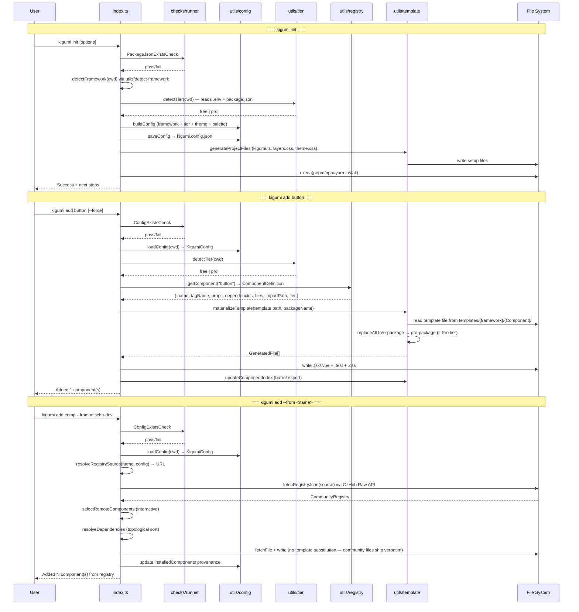
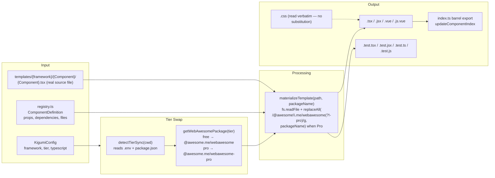
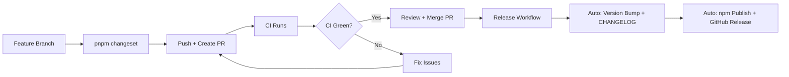

# Kigumi CLI - AI Agent Guide

> **shadcn/ui for Web Awesome** - Template-based CLI for React/Vue/Angular/Next.js wrappers around Web Awesome components.

**Version**: 0.27.2 | **Stack**: TypeScript, Commander, Zod

## Quick Start

```bash
pnpm build              # Build CLI + copy templates
pnpm test               # Run unit tests
pnpm lint && pnpm type-check  # Verify code quality
```

**Test the CLI:**

```bash
node dist/index.js init --framework=react --theme=awesome --yes
node dist/index.js add button --force
```

## Repository Structure

| Directory         | Purpose                                                        | Local AGENTS.md                            |
| ----------------- | -------------------------------------------------------------- | ------------------------------------------ |
| `src/`            | CLI source code                                                | [src/AGENTS.md](src/AGENTS.md)             |
| `templates/`      | Component templates (real `.tsx`/`.vue`/`.component.ts` files) | [templates/AGENTS.md](templates/AGENTS.md) |
| `tests/`          | Unit & E2E tests                                               | [tests/AGENTS.md](tests/AGENTS.md)         |
| `tools/`          | Local dev tooling (ESLint plugin); not published               | -                                          |
| `.claude/skills/` | AI agent skills                                                | -                                          |
| `dist/`           | Build output                                                   | -                                          |

**Key Files:**

| File                                     | Purpose                                                                                                                                                                                                                                                                                                  |
| ---------------------------------------- | -------------------------------------------------------------------------------------------------------------------------------------------------------------------------------------------------------------------------------------------------------------------------------------------------------- |
| `src/index.ts`                           | CLI entry point (Commander routing)                                                                                                                                                                                                                                                                      |
| `src/utils/registry.ts`                  | Component definitions (single source of truth)                                                                                                                                                                                                                                                           |
| `src/utils/tier.ts`                      | Free/Pro tier detection from `package.json` + `.env`                                                                                                                                                                                                                                                     |
| `src/utils/registry-resolver.ts`         | Resolves `--from` value (URL or saved registry name)                                                                                                                                                                                                                                                     |
| `src/commands/init/`                     | Project initialization                                                                                                                                                                                                                                                                                   |
| `src/commands/add/`                      | Component installation (built-in + community)                                                                                                                                                                                                                                                            |
| `src/commands/registry.ts`               | Community registry management (connect, list, remove)                                                                                                                                                                                                                                                    |
| `src/commands/theme/install.ts`          | Community theme installation from registry                                                                                                                                                                                                                                                               |
| `src/commands/theme/list.ts`             | List available themes for current tier                                                                                                                                                                                                                                                                   |
| `src/commands/theme/show.ts`             | Show current theme details                                                                                                                                                                                                                                                                               |
| `src/commands/list.ts`                   | List all available components (`--json` supported)                                                                                                                                                                                                                                                       |
| `src/commands/status.ts`                 | Project status (`--json` supported)                                                                                                                                                                                                                                                                      |
| `src/commands/upgrade.ts`                | Version upgrade + dependency installation                                                                                                                                                                                                                                                                |
| `src/commands/diff.ts`                   | Compare installed components vs current templates                                                                                                                                                                                                                                                        |
| `src/commands/update.ts`                 | Three-way merge update for installed components                                                                                                                                                                                                                                                          |
| `src/utils/diff-renderer.ts`             | Colored unified diff output using node-diff3 diffPatch                                                                                                                                                                                                                                                   |
| `src/utils/snapshot.ts`                  | Snapshot CRUD for `.kigumi/snapshots/`                                                                                                                                                                                                                                                                   |
| `src/utils/three-way-merge.ts`           | Three-way merge logic using `node-diff3`                                                                                                                                                                                                                                                                 |
| `src/utils/version-check.ts`             | CLI vs project version compatibility check                                                                                                                                                                                                                                                               |
| `src/utils/version-map.ts`               | Version history + breaking changes data                                                                                                                                                                                                                                                                  |
| `src/utils/github-fetcher.ts`            | GitHub registry fetcher (also handles local filesystem `RegistrySource` since 0.20.0)                                                                                                                                                                                                                    |
| `src/utils/foreign-files-staging.ts`     | Stages source-framework files into `.kigumi/foreign/<slug>/` for `--cross-framework`                                                                                                                                                                                                                     |
| `src/schemas/community-registry.ts`      | Community registry schema validation                                                                                                                                                                                                                                                                     |
| `scripts/parse-custom-elements.ts`       | Parse WA custom-elements.json ��� `component-metadata.ts` (events, slots, methods)                                                                                                                                                                                                                       |
| `scripts/find-cem.ts`                    | Locate Web Awesome Pro custom-elements.json on disk (shared by parser + freshness check)                                                                                                                                                                                                                 |
| `scripts/check-metadata-freshness.ts`    | Prebuild gate: exits 1 when `component-metadata.ts` is missing or older than the CEM, triggering regen                                                                                                                                                                                                   |
| `scripts/check-commit-attribution.ts`    | `commit-msg` hook: rejects AI attribution trailers (`Co-Authored-By: Claude`, `Generated with ...`). Prose mentioning Claude is deliberately allowed                                                                                                                                                     |
| `scripts/check-generated-fresh.ts`       | `validate:generated-fresh` drift guard. B: docs-wrapper CSS rules (comment-normalized) match templates; C: `.jsx` event surface is a subset of `.tsx`; D: starter-fixture CSS rules match templates. A (regenerate metadata/templates/skill-refs in a tmp copy + diff) self-skips when the CEM is absent |
| `scripts/generate-angular-templates.ts`  | Generate Angular component templates from registry + metadata                                                                                                                                                                                                                                            |
| `scripts/generate-react-templates.ts`    | Generate React component templates from registry + metadata                                                                                                                                                                                                                                              |
| `scripts/generate-vue-templates.ts`      | Generate Vue SFC templates from registry + metadata                                                                                                                                                                                                                                                      |
| `scripts/generator-utils.ts`             | Shared helpers (`DOM_GLOBALS`, `extractCustomTypeImports`) used by React + Vue generators                                                                                                                                                                                                                |
| `scripts/generate-skill-references.ts`   | Generate React/Vue/Angular API surface files for skills                                                                                                                                                                                                                                                  |
| `scripts/publish-skills.mjs`             | Copy whitelisted skills to docs/public/ for Vercel (whitelist lives here)                                                                                                                                                                                                                                |
| `scripts/generate-skills-index.mjs`      | Generate `.well-known/skills/index.json` from published skills                                                                                                                                                                                                                                           |
| `scripts/post-changeset-version.ts`      | Update version references after changeset version bump                                                                                                                                                                                                                                                   |
| `tools/eslint-plugin-kigumi/`            | Local ESLint plugin (plain directory, imported by relative path from `eslint.config.js`, not an npm package, no workspace). Rules are `.js` so `pnpm lint` needs no build step. Tested via RuleTester in `tests/unit/eslint-rules/`                                                                      |
| `scripts/setup-npmrc.mjs`                | Write Pro token from `.env` to `~/.npmrc` and `docs/.npmrc`                                                                                                                                                                                                                                              |
| `scripts/update-starter-snapshots.ts`    | Bulk-regenerate `tests/fixtures/starter-snapshots/` from local starter clones (env-var driven; see script header)                                                                                                                                                                                        |
| `scripts/validate-agents.ts`             | Validate AGENTS.md facts against codebase reality (6 checks: version, component counts, pro list, template dirs, test files, and prose count claims in `templates/AGENTS.md`)                                                                                                                            |
| `scripts/validate-cem-sync.ts`           | Validate CEM metadata is in sync with registry                                                                                                                                                                                                                                                           |
| `scripts/validate-changes.ts`            | Validate changeset entries                                                                                                                                                                                                                                                                               |
| `scripts/validate-gha-permissions.ts`    | Fail when a job running `actions/checkout` declares a job-level `permissions:` block without a readable `contents:`. Job-level blocks replace the workflow-level one rather than merging (the PR #173 regression)                                                                                        |
| `scripts/validate-parity.ts`             | Validate React/Vue/Angular template parity                                                                                                                                                                                                                                                               |
| `scripts/validate-registry.ts`           | Validate registry definitions are complete                                                                                                                                                                                                                                                               |
| `scripts/validate-story-lanes.ts`        | Check the shared interaction-lane story list against the stories actually tagged `interaction`, in both directions                                                                                                                                                                                       |
| `scripts/validate-fixture-exclusions.ts` | Check that `.prettierignore`, `eslint.config.js` and `tsconfig.tests.json` all exclude `tests/fixtures/starter-snapshots` (recorded CLI output that must not be reformatted)                                                                                                                             |
| `scripts/validate-templates.ts`          | Validate template rendering for all components                                                                                                                                                                                                                                                           |
| `scripts/validate-wa-pins.ts`            | Validate the six Web Awesome version pins agree, are exact, and that the newest VERSION_MAP entry matches `DEFAULT_WEBAWESOME_VERSION`                                                                                                                                                                   |
| `scripts/verify-test-app.ts`             | Verify test app output after build                                                                                                                                                                                                                                                                       |
| `scripts/storybook/overrides.ts`         | Storybook story overrides                                                                                                                                                                                                                                                                                |
| `scripts/storybook/patch-stories.ts`     | Patch generated Storybook stories                                                                                                                                                                                                                                                                        |
| `scripts/storybook/story-data.ts`        | Storybook story data helpers                                                                                                                                                                                                                                                                             |
| `scripts/storybook/validate-stories.ts`  | Validate Storybook story structure                                                                                                                                                                                                                                                                       |
| `scripts/state-files.ts`                 | Internal markdown-table parser for `docs/superpowers/state/*.md` (consumed by the three Phase-2 scripts)                                                                                                                                                                                                 |
| `scripts/state-staleness.ts`             | List initiatives whose state-file is older than N days; powers the `/weekly-review` skill                                                                                                                                                                                                                |
| `scripts/triage-finding.ts`              | Evaluate the 3-criteria new-finding rule and render a draft (Issue / PR-note / wontfix); powers `/triage-finding`                                                                                                                                                                                        |
| `scripts/release-readiness.ts`           | Run all pre-release gates + state-file meta-checks, persist a Go/No-Go report; powers `/release-readiness`                                                                                                                                                                                               |

---

## Skills

| Skill                        | Location                                     | Audience    | Purpose                                                                                   |
| ---------------------------- | -------------------------------------------- | ----------- | ----------------------------------------------------------------------------------------- |
| `kigumi-react`               | `.claude/skills/kigumi-react/`               | End user    | Convert WA HTML to Kigumi React JSX                                                       |
| `kigumi-vue`                 | `.claude/skills/kigumi-vue/`                 | End user    | Convert WA HTML to Kigumi Vue SFC                                                         |
| `kigumi-angular`             | `.claude/skills/kigumi-angular/`             | End user    | Convert WA HTML to Kigumi Angular                                                         |
| `kigumi-cross-framework`     | `.claude/skills/kigumi-cross-framework/`     | End user    | Convert components between React/Vue/Angular (paired with `kigumi add --cross-framework`) |
| `kigumi-compose-form`        | `.claude/skills/kigumi-compose-form/`        | End user    | Build forms with validation                                                               |
| `kigumi-compose-layout`      | `.claude/skills/kigumi-compose-layout/`      | End user    | Build page layouts, dashboards                                                            |
| `kigumi-compose-overlay`     | `.claude/skills/kigumi-compose-overlay/`     | End user    | Build dialogs, drawers, menus, toasts                                                     |
| `kigumi-compose-data`        | `.claude/skills/kigumi-compose-data/`        | End user    | Build data tables, stats, list views                                                      |
| `kigumi-theme`               | `.claude/skills/kigumi-theme/`               | End user    | Theme customization guidance                                                              |
| `generate-theme-preset`      | `.claude/skills/generate-theme-preset/`      | Contributor | Create Studio theme presets                                                               |
| `generate-component-wrapper` | `.claude/skills/generate-component-wrapper/` | Contributor | Generate React/Vue wrapper templates                                                      |
| `release`                    | `.claude/skills/release/`                    | Contributor | Prepare and publish releases                                                              |
| `kigumi-feature-spec`        | `.claude/skills/kigumi-feature-spec/`        | Contributor | Create feature specs and plans                                                            |
| `apply-theme-to-figma`       | `.claude/skills/apply-theme-to-figma/`       | Contributor | Apply CSS tokens to Figma UI Kit                                                          |

### Skills Publishing

End-user skills are published to `kigumi.style/.well-known/skills/` via Vercel. The mechanism:

1. `scripts/publish-skills.mjs` copies whitelisted skills from `.claude/skills/` into `docs/public/skills/` and `docs/public/.well-known/skills/`
2. `scripts/generate-skills-index.mjs` generates `index.json` from the copied directories
3. Internal directories (`evals/`) are excluded from the published output -- only `SKILL.md` and `references/` ship to consumers
4. Vercel serves `.well-known/skills/*` with CORS headers for cross-origin skill discovery

**When adding a new end-user skill**, add it to the `PUBLISHED_SKILLS` array in `scripts/publish-skills.mjs`. Contributor-only skills (e.g. `release`, `generate-component-wrapper`) are intentionally excluded.

---

## Critical Rules

### 1. Templates-First Development

**NEVER edit generated code. ALWAYS update the templates under `templates/`.**

Templates are real framework source files (`.tsx`, `.jsx`, `.vue`, `.component.ts`, `.test.*`). They are validated by `tsc` and `eslint` like any other source file. The CLI substitutes only one thing at runtime — the Free→Pro tier swap on the `@awesome.me/webawesome` import path; everything else is read verbatim.

```
Edit template → pnpm build → node dist/index.js add {component} --force → Test
```

- TypeScript: `.tsx` (with interfaces)
- JavaScript: `.jsx` (with JSDoc)
- See [templates/AGENTS.md](templates/AGENTS.md) for patterns

### 2. React Import Patterns

> **Why different?** TypeScript benefits from tree-shaking with named imports. JavaScript uses default import for broader compatibility with older bundlers.

**TypeScript (.tsx):** Use named imports

```typescript
import { forwardRef, useState, type HTMLAttributes } from 'react';
```

**JavaScript (.jsx):** Use default import + destructure

```javascript
import React from 'react';
const { useState } = React;
```

### 3. Web Components Use `class`, NOT `className`

```typescript
// Correct
<wa-button class={clsx('Button', className)}>

// Wrong - doesn't work
<wa-button className={className}>
```

### 4. TypeScript Declarations: Use `declare global`

**NEVER use `declare module 'react'`** - it overwrites React exports!

```typescript
// WRONG - breaks React
declare module 'react' {
  namespace JSX { ... }
}

// CORRECT - extends without breaking
declare global {
  namespace JSX {
    interface IntrinsicElements {
      'wa-button': React.DetailedHTMLProps<React.HTMLAttributes<HTMLElement>, HTMLElement>;
    }
  }
}
export {};
```

### 5. Event Listeners in useEffect (with cleanup)

```typescript
useEffect(() => {
  const el = ref.current;
  if (!el) return;
  el.addEventListener('wa-show', handleShow);
  return () => el.removeEventListener('wa-show', handleShow);
}, [onShow]);
```

### 6. Web Component Registration

Generated wrappers register their WA component via a mount-triggered dynamic `import()` inside the wrapper itself, not through a central barrel. Each component becomes its own async chunk, so unused components are tree-shaken out of route bundles. For LCP-critical components that must ship in the initial chunk, add an explicit eager import in `src/lib/kigumi.ts`:

```typescript
import '@awesome.me/webawesome/dist/components/button/button.js';
```

### 7. Dialog API: `requestClose()` not `hide()`

```typescript
hide: () => dialogRef.current?.requestClose(),
requestClose: () => dialogRef.current?.requestClose(),
```

### 8. Angular: `CUSTOM_ELEMENTS_SCHEMA`

Always include in `schemas` array for standalone components that use `wa-*` elements:

```typescript
@Component({
  schemas: [CUSTOM_ELEMENTS_SCHEMA],
})
```

### 9. Angular: `k-` Selector Prefix

All Kigumi Angular components use `k-` prefix (e.g., `<k-button>`, `<k-dialog>`).

### 10. Angular: Event Collision Suffixes

Native DOM events collide with Angular lifecycle methods. The `@Output()` names use suffixes:

| WA Event | Angular @Output() |
| -------- | ----------------- |
| `blur`   | `blurEvent`       |
| `focus`  | `focusEvent`      |
| `show`   | `showEvent`       |
| `input`  | `inputEvent`      |

Non-colliding events keep their base name: `wa-hide` -> `hide`, `wa-after-show` -> `afterShow`.

### 11. Angular: CVA for Form Controls

Form controls implement `ControlValueAccessor`. Use `[(ngModel)]` or `[formControl]`, never manual event wiring for value tracking.

### 12. Next.js Is a React Variant

Next.js projects — **App Router and Pages Router, both with or without a `src/` layout** — use the existing React plugin and React templates. `config.framework` stays `'react'`. The Next-specific behavior branches on three runtime detectors in `src/utils/detect-framework.ts`:

- `isNextProject(cwd)` — `true` when `next` is a dep or a `next.config.*` file exists.
- `detectNextRouter(cwd)` — `'app' | 'pages' | 'unknown'`; App Router wins when both dirs coexist.
- `detectSourceLayout(cwd)` — `'src' | 'root'`; drives Kigumi's directory defaults and the `@/*` tsconfig alias target so `create-next-app` with or without `--src-dir` both work without rewriting user config.

What this enables:

- Every generated React wrapper starts with `'use client';`. App Router needs it; Pages Router treats it as a harmless string, so emitting it uniformly means a project can migrate routers without regenerating wrappers.
- `src/lib/kigumi.ts` (or `lib/kigumi.ts` in root layout) also starts with `'use client';` — the `customElements.define` side-effect needs the browser.
- Every wrapper's `<wa-*>` host element carries `suppressHydrationWarning`. Lit reflects default attributes to the DOM during `connectedCallback`; `suppressHydrationWarning` is the documented React API for that pattern (one-level, children still reconcile) and a no-op in non-SSR contexts.
- `init` skips `vite.config.ts` path-aliasing, picks `tsconfig.json` when `tsconfig.app.json` is absent, emits a sibling `web-awesome.d.ts` (no `vite/client` reference) instead of `vite-env.d.ts`, and — **only for App Router** — writes `providers.tsx` with a `KigumiProvider` Client Module next to `app/`.
- **Pages Router projects are not scaffolded** with a new file; the user's `pages/_app.tsx` is their own. Post-install output prints three imports (`layers.css`, `theme.css`, `@/lib/kigumi`) + the `AppProps` wrapper to add manually.
- **Pages Router CSS policy**: Next forbids global CSS imports anywhere other than `pages/_app.tsx`. Kigumi handles this at generation time by (a) omitting the `layers.css` import from the generated `lib/kigumi.ts` and (b) stripping the per-component `import './<Name>.css';` line from each generated wrapper. Both are unconditional when `detectNextRouter(cwd) === 'pages'`, and unchanged for App Router. Per-component stub CSS files are still emitted so users can add imports to `_app.tsx` if they want custom styles.
- `generateGitIgnore` adds `.kigumi/cache/` in addition to `.kigumi/foreign/`. `.kigumi/snapshots/` stays tracked (three-way merge depends on it); `.npmrc` stays committable (registry URL only, no token).

Do not add a `'next'` entry to the `framework` enum — duplicating templates under `templates/nextjs/` would force parallel maintenance of 84 components for no gain.

---

## CSS Utilities

Prefer Web Awesome utility classes over custom CSS for layout and style composition:

**Layout utilities** (`.wa-` prefix — applied via `className` on plain HTML elements):

| Class         | Purpose                                 |
| ------------- | --------------------------------------- |
| `.wa-stack`   | Vertical stacking with consistent gap   |
| `.wa-grid`    | Responsive column grid                  |
| `.wa-cluster` | Horizontal wrapping group (tags, chips) |
| `.wa-flank`   | Sidebar + main content split            |
| `.wa-frame`   | Aspect-ratio constrained container      |
| `.wa-split`   | Two equal columns                       |

**Style utilities:**

| Class      | Purpose                                |
| ---------- | -------------------------------------- |
| `.wa-dark` | Applies dark color scheme to a subtree |

Reference: https://webawesome.com/docs/utilities/ and https://webawesome.com/docs/layout/

---

## Tier System

**Single source of truth:** `package.json` determines tier (with token fallback), NOT config.

| Tier | Detection                                    | Package                      | Themes    |
| ---- | -------------------------------------------- | ---------------------------- | --------- |
| Free | `@awesome.me/webawesome` in package.json     | `@awesome.me/webawesome`     | 3 themes  |
| Pro  | `@awesome.me/webawesome-pro` in package.json | `@awesome.me/webawesome-pro` | 11 themes |

**Pro-only components:** chart, bar-chart, line-chart, bubble-chart, doughnut-chart, pie-chart, polar-area-chart, radar-chart, scatter-chart, combobox, file-input, number-input, sparkline, toast, toast-item, video, video-playlist, date-picker, date-input

### Tier Detection Logic

```typescript
// src/utils/tier.ts - Detects tier with package.json priority
async function detectTier(cwd: string): Promise<Tier> {
  // 1. Check package.json first (installed package is source of truth)
  const pkg = await fs.readJSON('package.json');
  if (pkg.dependencies?.['@awesome.me/webawesome-pro']) return 'pro';
  if (pkg.dependencies?.['@awesome.me/webawesome']) return 'free';

  // 2. Fallback to token detection (.env or ~/.npmrc)
  const token = await detectProToken(cwd);
  return token ? 'pro' : 'free';
}
```

**Detection priority:**

1. `package.json` dependencies (highest priority - actual installed package)
2. Environment variable `$WEBAWESOME_NPM_TOKEN` (CI/CD)
3. Global `~/.npmrc` token (set via `pnpm run setup:npmrc`)
4. Project `.env` file (`WEBAWESOME_NPM_TOKEN`)
5. Default to `free` if none found

**Token Setup (Architecture):**

The repository includes `scripts/setup-npmrc.mjs` which reads tokens from `.env` files
and writes them to:

- Global `~/.npmrc` (for npm/yarn)
- `docs/.npmrc` (gitignored) - **required for pnpm**, which does not use global auth for scoped registries

```bash
# Setup token (after clone, or when .env changes)
pnpm run setup:npmrc
```

This approach:

- Works with npm, pnpm, AND yarn
- Supports different tokens per machine (reads from `docs/.env` or root `.env`)
- `docs/.npmrc` is gitignored and generated from `.env` (token never committed)

**docs/ vs. User Projects:**

| Context           | `.npmrc` location | Token source                                       |
| ----------------- | ----------------- | -------------------------------------------------- |
| User project      | Project root      | Registry URL only; token from global or `.env`     |
| docs/ (this repo) | `docs/.npmrc`     | Gitignored; generated by `setup:npmrc` from `.env` |

User projects get `.npmrc` with registry URL only via `kigumi init`. The docs app needs the token in its project `.npmrc` because pnpm does not use global auth for scoped registries.

### Migration Triggers

| Previous | New  | Action                                     |
| -------- | ---- | ------------------------------------------ |
| free     | pro  | Migrate imports to `-pro`, update `.npmrc` |
| pro      | free | Reverse migrate imports, update `.npmrc`   |

**Critical files:** `src/commands/init/migration.ts`, `src/commands/init/installer.ts`

---

## Code Quality (Zero Tolerance)

Pre-commit hooks enforce all checks. **All must pass before commit:**

```bash
pnpm lint          # ESLint: 0 problems
pnpm type-check    # TypeScript: 0 errors
pnpm format:check  # Prettier: all formatted
pnpm test          # Vitest: all passing
```

**Auto-fix:** `pnpm lint:fix && pnpm format`

---

## Architecture

### Module Boundaries

| Layer    | Directory       | Responsibility                                              |
| -------- | --------------- | ----------------------------------------------------------- |
| Entry    | `src/index.ts`  | CLI routing, error handling                                 |
| Commands | `src/commands/` | User-facing operations                                      |
| Utils    | `src/utils/`    | Business logic (registry, tier, config)                     |
| Schemas  | `src/schemas/`  | Zod validation                                              |
| Errors   | `src/errors/`   | Typed error classes                                         |
| Output   | `src/output/`   | Console formatting (delegates to prompts wrapper)           |
| Prompts  | `src/prompts/`  | `@clack/prompts` wrapper + DI hook (`setPromptsForTesting`) |

### Module Dependency Graph

```mermaid
flowchart TD
    subgraph Entry["CLI Entry"]
        CLI["src/index.ts\nCommander routing"]
    end

    subgraph Commands["commands/"]
        init["init/\nconfig-builder, file-generator\nmigration, installer"]
        add["add/\ncomponent-selector, validator\ninstaller, remote-installer"]
        theme["theme/\nset, install"]
        doctor["doctor.ts"]
        brand["brand.ts"]
        palette["palette.ts"]
        list["list.ts"]
        status["status.ts"]
        registry_cmd["registry/\ninit, validate, connect\nlist, remove"]
        upgrade["upgrade.ts"]
        diff["diff.ts"]
        update["update.ts"]
    end

    subgraph Utils["utils/"]
        registry["registry.ts\n84 ComponentDefinitions\nprops, deps, files, importPath"]
        template["template.ts\nmaterializeTemplate (read + tier swap)"]
        tier["tier.ts\nFree/Pro detection\ndetectTier, detectTierSync"]
        config["config.ts\ncosmiconfig loader\nloadConfig, saveConfig, getConfig"]
        detect_fw["detect-framework.ts\ngetProjectInfo"]
        regenerate["regenerate.ts"]
        snapshot["snapshot.ts\n.kigumi/snapshots/ CRUD"]
        merge["three-way-merge.ts\nnode-diff3 merge logic"]
        github_fetcher["github-fetcher.ts\nURL parsing, raw fetch"]
        github_token["github-token.ts\nPAT resolution"]
        registry_cache["registry-cache.ts\nDisk cache with TTL"]
        registry_resolver["registry-resolver.ts\nresolveRegistrySource()"]
        version_check["version-check.ts\ncheckVersionCompatibility()"]
        version_map["version-map.ts\nVERSION_MAP, breaking changes"]
    end

    subgraph Schemas["schemas/"]
        schema_config["config.ts — Zod KigumiConfig"]
        schema_options["options.ts — Zod command options"]
        schema_tier["tier.ts — Zod tier types"]
        schema_community["community-registry.ts\nZod registry schema"]
    end

    subgraph Errors["errors/"]
        err_base["base.ts — KigumiError"]
        err_config["config.ts"]
        err_net["network.ts"]
        err_community["community-registry.ts"]
        err_version["version.ts\nVersionMismatchError"]
    end

    subgraph Checks["checks/"]
        check_runner["runner.ts — CheckRunner"]
        check_config["config-checks.ts"]
    end

    subgraph Templates["templates/"]
        tpl_react["react/ — 84 components\n.tsx, .jsx\n.test.tsx, .test.jsx, .css"]
        tpl_vue["vue/ — 84 components\n.vue, .js.vue\n.test.ts, .test.js, .css"]
        tpl_angular["angular/ — 84 components\n.component.ts, .component.spec.ts, .component.css"]
    end

    CLI --> Commands
    init --> config
    init --> tier
    init --> template
    init --> detect_fw
    add --> registry
    add --> tier
    add --> template
    add --> check_runner
    add --> github_fetcher
    add --> schema_community
    add --> registry_resolver
    theme --> config
    theme --> registry_resolver
    registry_cmd --> config
    registry_cmd --> github_fetcher
    doctor --> config
    doctor --> tier
    doctor --> constants
    upgrade --> config
    upgrade --> version_map
    diff --> config
    diff --> template
    diff --> registry
    diff --> snapshot
    update --> config
    update --> template
    update --> registry
    update --> snapshot
    update --> merge
    add --> snapshot
    add --> version_check

    template --> tpl_react & tpl_vue & tpl_angular
    template --> registry
    template --> css_meta

    github_fetcher --> github_token
    github_fetcher --> registry_cache

    config --> schema_config
    add --> schema_options
    tier --> schema_tier
    check_runner --> check_config & check_deps
    Commands --> Errors
```



### Command Flows



### Template Pipeline



---

## Debugging

| Problem             | Check                       | Fix                                                                            |
| ------------------- | --------------------------- | ------------------------------------------------------------------------------ |
| Components unstyled | `kigumi.ts` imports?        | Confirm `layers.css` import. WA JS loads per-component on mount (no barrel).   |
| TypeScript errors   | `declare module 'react'`?   | Use `declare global` instead                                                   |
| wa-\* type errors   | `vite-env.d.ts` exists?     | Run `generateViteEnvDts()`                                                     |
| Theme not applying  | CSS imported? HTML classes? | Check `kigumi.ts` imports                                                      |
| Theme conflicts     | Duplicate theme imports?    | Verify `theme.css` has no `@import`                                            |
| Tier wrong          | `.env` has token?           | Use `detectTier()`                                                             |
| Free→Pro fails      | Migration ran?              | Check `migration.ts`                                                           |
| Wrong import paths  | Mixed free/pro imports?     | Run `kigumi doctor`                                                            |
| Stale WA version    | Config or package outdated? | Run `kigumi doctor`                                                            |
| Version mismatch    | `kigumiVersion` in config?  | Run `kigumi upgrade`                                                           |
| JSON parse fails    | File has comments?          | Use `readJSONWithComments()`                                                   |
| 401 in docs/        | `docs/.npmrc` present?      | Run `pnpm run setup:npmrc`                                                     |
| Broken error URLs   | `https://https://` prefix?  | Use constants from `src/constants.ts` (`GITHUB_ISSUES_URL`, `GITHUB_REPO_URL`) |
| Unhandled error     | `catch {}` swallows error?  | Always capture: `catch (_error) {}` with descriptive comment                   |
| Config validation   | Generic `Error` thrown?     | Use `ConfigInvalidError` from `src/errors/config.ts`                           |

---

## Common Mistakes

1. Editing generated code instead of the templates under `templates/`
2. Using `className` on `<wa-*>` elements (use `class`)
3. Using `declare module 'react'` (use `declare global`)
4. Event listeners in ref callback (use `useEffect`)
5. Using `fs.readJSON()` on files with comments
6. Storing tier in config (detect from `.env`)
7. Using `any` type (use `unknown` or proper types)
8. **Using `!important` to override Web Awesome styles** (use CSS layers - `theme.css` automatically overrides base)
9. **Manually editing `layers.css` or `kigumi.ts`** (auto-generated - use `kigumi theme` commands)
10. **Adding Web Awesome imports to `theme.css`** (all imports handled in `layers.css`)
11. Making assumptions - ask for help if unsure
12. **Manually editing community registry files** instead of using `kigumi registry` commands
13. **Importing `KigumiConfig` from `utils/config.ts`** (old interface, incomplete) — use `schemas/config.ts` (Zod-inferred, has `registries`, `installedThemes`, etc.)
14. **Hardcoding GitHub URLs** — use `GITHUB_ISSUES_URL` / `GITHUB_REPO_URL` from `src/constants.ts`
15. **Silent `catch {}` blocks** — always capture the error variable (`catch (_error)`) and add a descriptive comment explaining why it's intentionally ignored
16. **Using `process.exit()` in commands** — use `handleError(error, output)` from `src/errors/index.ts` for consistent error reporting

---

## Auto-Generated Files

| File                                | Purpose                                                                                  | Regenerated When                                                                                 | User-Editable      |
| ----------------------------------- | ---------------------------------------------------------------------------------------- | ------------------------------------------------------------------------------------------------ | ------------------ |
| `src/lib/kigumi.ts`                 | Imports layers.css and applies theme classes to `<html>`                                 | Theme/brand/palette commands                                                                     | ❌ No              |
| `src/styles/layers.css`             | Wraps Web Awesome CSS in cascade layers                                                  | Theme/brand/palette commands                                                                     | ❌ No              |
| `src/styles/theme.css`              | User custom CSS overrides                                                                | Only on init (if missing)                                                                        | ✅ Yes - preserved |
| `src/vite-env.d.ts`                 | JSX augmentation importing official Web Awesome `CustomElements` / `CustomCssProperties` | Only on init (React Vite + TS); `kigumi doctor` advisory for legacy `src/types/web-awesome.d.ts` | ❌ No              |
| `src/web-awesome.d.ts`              | Next.js-flavored variant of `vite-env.d.ts` (no `vite/client` reference)                 | Only on init (Next.js + TS)                                                                      | ❌ No              |
| `src/styles/community-themes/*.css` | Downloaded community theme CSS                                                           | `kigumi theme install --from`                                                                    | ❌ No              |
| `.npmrc` (user project)             | Registry URL only (no token)                                                             | Only on init                                                                                     | ❌ No              |
| `docs/.npmrc`                       | Registry + token (gitignored)                                                            | `pnpm run setup:npmrc`                                                                           | ❌ No              |

**Key Points:**

- `layers.css` uses CSS `@layer` for cascade control (base < theme)
- `layers.css` distinguishes built-in themes (from WA package) vs community themes (from `community-themes/` dir)
- `theme.css` is preserved on re-init - existing user styles won't be overwritten
- Theme/brand commands regenerate `kigumi.ts` + `layers.css` but preserve `theme.css`
- JSX type declarations (`vite-env.d.ts` / `web-awesome.d.ts`) augment `IntrinsicElements` with `CustomElements` from the official Web Awesome package. That covers every `wa-*` element (including the `class?` attribute and all WA events). Kigumi no longer hand-rolls per-component types; legacy `src/types/web-awesome.d.ts` files are flagged by `kigumi doctor`.

---

## Decision Trees & Checklists

### Decision Tree: Component Task Type

```
START: User requests component change
│
├─ "Add new component"
│  ├─ Check: Component in registry? → NO
│  │  └─ ACTION: Use generate-webawesome-component skill
│  │     └─ Creates templates → registry entry → tests
│  │
│  └─ Check: Component in registry? → YES
│     └─ ACTION: User wants to install it
│        └─ Run: `kigumi add <component>`
│
├─ "Fix/improve existing component"
│  ├─ Check: Issue in generated code?
│  │  └─ ACTION: Edit the framework template file
│  │     └─ Path: templates/{framework}/{ComponentName}/
│  │     └─ Rebuild: pnpm build
│  │     └─ Test: node dist/index.js add {component} --force
│  │
│  └─ Check: Issue in CLI logic?
│     └─ ACTION: Edit src/ files
│        └─ Commands: src/commands/
│        └─ Utils: src/utils/
│        └─ Test: pnpm test
│
└─ "Update component metadata"
   └─ ACTION: Edit src/utils/registry.ts
      └─ Update: name, tagName, importPath, tier, category, description, props
      └─ Validate: pnpm validate:registry
      └─ Test: pnpm test
```

### Decision Tree: Tier-Related Changes

```
START: Change affects tier detection or packages
│
├─ "Detect tier for project"
│  ├─ Priority 1: Check package.json dependencies
│  │  └─ @awesome.me/webawesome-pro → pro tier
│  │  └─ @awesome.me/webawesome → free tier
│  │
│  ├─ Priority 2: Check .env for WEBAWESOME_NPM_TOKEN
│  │  └─ Token present → pro tier
│  │
│  └─ Priority 3: Check ~/.npmrc for global token
│     └─ Token present → pro tier
│     └─ No token → free tier (default)
│
├─ "Change tier logic"
│  └─ ACTION: ONLY edit src/utils/tier.ts
│     └─ Functions: detectTier(), detectTierSync(), getWebAwesomePackage()
│     └─ Test: tests/unit/tier.test.ts
│
└─ "Add tier-restricted component"
   └─ ACTION: Edit src/utils/registry.ts
      └─ Set tier: 'pro' or 'free'
      └─ Validator: src/commands/add/validator.ts checks tier
      └─ Test: Add TierRestrictionError test
```

### Checklist: Before Committing Template Changes

- [ ] **Edited the framework template (not generated code)**
  - Path: `templates/{framework}/{ComponentName}/*.{tsx,jsx,vue,js.vue,component.ts,test.*}`
  - All frameworks: React AND Vue AND Angular
  - All variants: TypeScript AND JavaScript (Angular is TS-only)

- [ ] **Rebuilt CLI**
  - `pnpm build`

- [ ] **Generated & tested component**
  - `node dist/index.js add {component} --force`
  - Visual check: Component renders correctly
  - Browser test: Events work, styles apply

- [ ] **Verified template syntax**
  - No stray `{{...}}` tokens (caught by `pnpm validate:templates` and the `no-handlebars-tokens` unit test)
  - React: `class` not `className` for `<wa-*>`
  - TypeScript: Named imports, interfaces
  - JavaScript: Default import, JSDoc

- [ ] **Updated tests**
  - Unit: Template rendering test
  - Integration: Compile-check test
  - Snapshot: Visual regression (if applicable)

### Checklist: Before Adding New Component

- [ ] **Component documentation ready**
  - Web Awesome docs URL
  - Component tag name (e.g., `wa-button`)
  - Import path pattern
  - Props list with types and defaults

- [ ] **Registry entry complete**
  - Name (PascalCase)
  - tagName (kebab-case, starts with `wa-`)
  - importPath (@awesome.me/webawesome/...)
  - tier ('free' or 'pro')
  - category (matches existing categories)
  - description (concise, user-facing)
  - props (array of objects with name, type, default, description)

- [ ] **Templates created (all frameworks)**
  - `templates/react/{ComponentName}/{ComponentName}.tsx`
  - `templates/react/{ComponentName}/{ComponentName}.jsx`
  - `templates/react/{ComponentName}/{ComponentName}.test.tsx`
  - `templates/react/{ComponentName}/{ComponentName}.test.jsx`
  - `templates/react/{ComponentName}/{ComponentName}.css`
  - `templates/vue/{ComponentName}/{ComponentName}.vue`
  - `templates/vue/{ComponentName}/{ComponentName}.js.vue`
  - `templates/vue/{ComponentName}/{ComponentName}.test.ts`
  - `templates/vue/{ComponentName}/{ComponentName}.test.js`
  - `templates/vue/{ComponentName}/{ComponentName}.css`
  - `templates/angular/{ComponentName}/{kebab-name}.component.ts`
  - `templates/angular/{ComponentName}/{kebab-name}.component.spec.ts`
  - `templates/angular/{ComponentName}/{kebab-name}.component.css`

- [ ] **Validation passed**
  - `pnpm validate:registry` → ✅
  - `pnpm validate:templates` → ✅
  - `pnpm test` → ✅

- [ ] **Docs site & agent surfaces (hand-maintained — no validator catches these)**
  - `docs/src/components/ui/{ComponentName}/` wrapper + export in `docs/src/components/ui/index.ts`
  - `docs/src/stories/{ComponentName}.stories.tsx` with argTypes, a `ChromaticOnly` story, and (if the component emits events) an `interaction`-tagged `Default` story with a `play` function
  - Interaction-test lane registration: add the story file to BOTH `docs/.storybook-test/main.ts` (`stories`) and `docs/vitest.storybook.config.ts` (`server.warmup.clientFiles`)
  - Components overview grid: entry in `componentsByCategory` in `docs/src/components/storybook/StorybookComponentGrid.tsx` + 920×600 dark-theme PNG in `docs/src/assets/components/`
  - Relevant `kigumi-compose-*` skill selection tables (e.g. form controls → `kigumi-compose-form/SKILL.md` + `references/form-component-cheatsheet.md`)
  - Component counts in `templates/AGENTS.md` and `.claude/skills/kigumi-angular/SKILL.md`

### Checklist: Web Awesome Version Bump

The code/registry side is guarded by validators (`validate:cem-sync`, `validate:registry`, `validate:generated-fresh`, `validate:wa-pins`). The surfaces below are **hand-maintained** and were the source of all drift found in the WA 3.7.0–3.10.0 audit (see `docs/superpowers/state/wa-drift-audit-2026-07-02.md`). Walk this list on every bump:

- [ ] **Pins** (now enforced — run `pnpm validate:wa-pins`): `package.json`, `docs/package.json`, `docs/kigumi.config.json`, root `kigumi.config.json` (dogfooding), `src/constants.ts` `DEFAULT_WEBAWESOME_VERSION`, `src/utils/version-map.ts` newest entry. All six must name the same exact version. **Adding the `version-map.ts` entry is not optional**: `kigumi upgrade` installs whatever the newest entry names, so skipping it makes upgrade hand users an older Web Awesome than the CLI ships.
- [ ] **New upstream components**: either full wrapper (run the "Before Adding New Component" checklist above, including the docs-site items) or an explicit entry in `INTENTIONALLY_UNWRAPPED` in `scripts/validate-cem-sync.ts` with rationale
- [ ] **Changed props/defaults/enum values**: check every changelog line against templates, `docs/src/components/ui`, stories (argTypes `defaultValue` summaries!), and registry prop values — new enum values need a demo story (e.g. Tree `leaf-multiple`)
- [ ] **Removed CSS custom properties / parts**: grep repo-wide for the removed name; also confirm it is absent from `kigumi-theme` references
- [ ] **Theme token docs**: re-validate `.claude/skills/kigumi-theme/references/css-variables.md` and `available-themes.md` against the new `dist/styles/themes/default.css` and palette/theme file listing; bump the "Source:" footer version
- [ ] **Skill tables**: new components reflected in the relevant `kigumi-compose-*` skills; regenerated `.claude/skills/shared/*-api-surface.md` committed
- [ ] **AGENTS.md sync**: component counts + "Last Updated" in root, `src/`, `templates/`, `tests/` AGENTS.md — `templates/AGENTS.md` is the one that historically gets missed
- [ ] **Storybook grid**: new components added to `StorybookComponentGrid.tsx` + thumbnail PNGs
- [ ] **Zero-warning gate**: `pnpm validate:cem-sync` must pass with 0 warnings (new unwrapped components must be consciously triaged, not left warning)

### Checklist: Before Merging PR

- [ ] **All tests pass**
  - Unit tests: `pnpm test`
  - Integration tests: `pnpm test:integration`
  - Linting: `pnpm lint`
  - Type-check: `pnpm type-check`

- [ ] **Validation scripts pass**
  - Registry: `pnpm validate:registry`
  - Templates: `pnpm validate:templates`
  - Changes: `pnpm validate:changes`

- [ ] **CI pipeline green**
  - Lint & Format job
  - Test job (Node 22)
  - Integration Tests job
  - Coverage job (>=63%)
  - TypeScript Check job
  - Validate Registry & Templates job
  - License Check job
  - Security Audit job
  - Chromatic visual regression job

- [ ] **Documentation updated**
  - CHANGELOG.md (if user-facing)
  - README.md (if CLI changes)
  - AGENTS.md (if workflow changes)

- [ ] **No regressions**
  - Existing components still generate
  - Existing tests still pass
  - No tier logic broken

### Checklist: Debugging Failed Generation

- [ ] **Check template completeness**
  - Run: `pnpm validate:templates`
  - Look for: Missing files per framework, stray `{{...}}` tokens

- [ ] **Check registry consistency**
  - Run: `pnpm validate:registry`
  - Look for: Wrong paths, missing props, duplicates

- [ ] **Check tier detection**
  - Run: `pnpm run doctor`
  - Look for: Wrong package imports (free vs pro)

- [ ] **Check TypeScript compilation**
  - Test: Run compile-check integration test
  - Look for: Type errors in generated code

- [ ] **Check runtime errors**
  - Start dev server with generated component
  - Open browser console
  - Look for: Import errors, undefined references

---

## Questions Before Changes

1. Does this need template changes (`templates/{framework}/{Component}/`)?
2. Works with React 18 AND 19?
3. Tier restrictions correct?
4. TypeScript errors for users?
5. Web components need imports?
6. Event listeners cleaned up?
7. Tested in browser?

---

## Release Workflow

> **For AI Agents:** This section documents the release process. Follow these steps strictly for consistency.

### Overview

Fully automated release pipeline: **merge PR to main = release** (when changesets exist).



**Control points:**

- Review PR before merge (full control over what ships)
- CI must pass before merge (quality gate)
- No manual steps after merge (fully automated)

### Developer Workflow

**Step 1: Create feature branch and make changes**

```bash
git checkout -b feat/my-feature
# ... make changes ...
git add .
git commit -m "feat: add new component"
```

Rules:

- Use conventional commit messages (feat/fix/docs/chore/refactor)
- **NEVER** use `--amend` on pushed commits
- **NEVER** rebase after pushing

**Step 2: Create changeset (if user-facing)**

| Change Type           | Changeset? | Severity | Examples                   |
| --------------------- | ---------- | -------- | -------------------------- |
| New component         | Yes        | `minor`  | Add Dialog component       |
| New CLI command       | Yes        | `minor`  | Add `kigumi theme` command |
| Bug fix (user-facing) | Yes        | `patch`  | Fix Button event handler   |
| Breaking change       | Yes        | `major`  | Remove deprecated prop     |
| Docs only             | No         | -        | Update README              |
| Tests only            | No         | -        | Add unit tests             |
| Refactor (internal)   | No         | -        | Reorganize utils           |
| CI/Build changes      | No         | -        | Update GitHub Actions      |

```bash
pnpm changeset
# Select patch/minor/major, write user-facing summary
git add .changeset/*.md
git commit -m "chore: add changeset"
```

The summary **must** start with a Keep a Changelog category header (`### Added` / `### Changed` / `### Fixed` / `### Deprecated` / `### Removed` / `### Security` / `### Breaking Changes`), e.g.:

```markdown
### Fixed

- **Scope**: What was broken and what changed
```

Content without a header is silently dropped from `CHANGELOG.md` at release time (`scripts/post-changeset-version.ts` only buckets lines that follow a header). `pnpm validate:changesets` (wired into CI) catches this before merge — see `.claude/skills/release/SKILL.md` for the full format.

**Step 3: Push and create PR**

```bash
git push -u origin HEAD
gh pr create --title "feat: my feature" --body "Description..."
```

**Step 4: Wait for CI, review, merge**

All checks must pass before merge:

- Lint & Format
- Test (Node 22)
- Integration Tests
- Coverage (>=63%)
- TypeScript Check
- Validate Registry & Templates
- License Check
- Security Audit
- Chromatic (visual regression)

Once CI passes and review is approved, merge via GitHub UI (squash or merge commit, no rebase).

### What Happens After Merge (Fully Automated)

1. **Release workflow** (`.github/workflows/release.yml`) triggers on push to main
2. **CI runs** again via reusable workflow (`.github/workflows/ci.yml`)
3. **If changesets exist:**
   - `changeset version` bumps `package.json` and updates `CHANGELOG.md`
   - `pnpm build && changeset publish` builds and publishes to npm
   - GitHub Release with git tag is created automatically
4. **If no changesets:** Nothing happens (no release)

### Manual Release (Emergency Only)

If automation fails:

```bash
pnpm changeset version
pnpm release
```

**NEVER do this** unless automation is broken. Document reason in a follow-up PR.

### Branch Protection

**main** branch is protected:

- Require PR before merging
- Require CI status checks (`quality`, `test`, `pack-test` are the always-on baseline)
- Require conversation resolution
- No force push allowed
- No direct commits

### CI Optimization (Path-Aware Gating)

To stay inside the GitHub Actions allowance, `ci.yml` runs heavy jobs only when relevant paths change. The `changes` job (top of `ci.yml`) uses `dorny/paths-filter@v4` to compute outputs (`docs`, `src`, `templates`, `integration`, `e2e`, `starters`, `story`, `deps`), and each gated job's `if:` predicate references those outputs.

**Always-on jobs:** `quality`, `test`, `pack-test`. These are the required status checks for branch protection.

**Path-gated jobs:** `integration`, `e2e`, `starters`, `docs-typecheck`, `story-interactions`. Skipped if paths don't match.

**Override mechanisms (force every heavy job to run):**

1. Add the `full-ci` label to the PR. The `labeled` PR trigger re-fires CI, and every gated job's `if:` falls through to the override branch.
2. Push to a branch named `changeset-release/main`. The changesets-bot Version Packages PR uses this head ref, so pre-release CI is always exhaustive.

**When to add a new path filter:** any time a new top-level directory or file pattern lands that should drive a heavy job. Update the `changes` job's `filters:` block in `ci.yml` and adjust the relevant gate. If you add a top-level directory that doesn't fit any existing filter, the safest default is to add it under `deps` (which is in every heavy gate) until you know which job it should drive.

**`visual-test` label** is a separate, narrower override that forces the Chromatic job to run when no visual paths changed. It is unrelated to `full-ci`.

**Dynamic matrix sizes (Integration + Starter):** beyond skipping jobs entirely, the `changes` job also computes the matrix size for the two matrix jobs and emits it as JSON outputs (`integration_matrix`, `starter_matrix`).

| Trigger                                            | Integration matrix                             | Starter matrix                        |
| -------------------------------------------------- | ---------------------------------------------- | ------------------------------------- |
| `full-ci` label or `changeset-release/main`        | 4 entries (react@18, react@19, vue@3, angular) | 4 entries (react, vue, angular, next) |
| `templates` or `deps` changed                      | 3 entries (drop react@18)                      | 4 entries                             |
| `src` (or `integration` / `starters` / `e2e`) only | 3 entries                                      | 1 entry (react)                       |

The reduction is safe because: (1) react@18-vs-19 differences are JSX-typing only and bounded; (2) starter coverage for non-react frameworks is high-value only when templates or deps change; (3) any regression missed on a regular PR is caught at the next release PR (full matrix auto-fires on `changeset-release/main`) before publish. To force the full matrix on a regular PR, add the `full-ci` label.

### Troubleshooting

| Problem                | Solution                                          |
| ---------------------- | ------------------------------------------------- |
| CI fails on main       | Fix in new PR, do not force push                  |
| Release workflow fails | Check NPM_TOKEN secret in GitHub                  |
| No release after merge | Ensure `.changeset/*.md` files were in the PR     |
| Publish fails          | Verify package.json version not already published |
| Wrong version bumped   | Recreate changeset with correct severity          |

### Quick Reference

```bash
# Create changeset (user-facing changes only)
pnpm changeset

# Check what will be released
pnpm changeset status

# Local test before merge
pnpm build && pnpm test && pnpm lint && pnpm type-check

# View CI status
gh pr checks

# Pre-release: aggregate gates + state-file meta-checks into a Go/No-Go report
# (writes docs/superpowers/state/release-readiness-YYYY-MM-DD.md)
pnpm release-readiness               # full run
pnpm release-readiness:quick         # skip e2e

# Triage a finding against the 3-criteria new-finding rule (Phase 1)
pnpm triage-finding evaluate --json '{"finding":{...},"criteria":{"K1":...,"K2":...,"K3":...}}'

# List initiatives whose state-file is older than 14 days
pnpm state-staleness list
```

---

## Related Documentation

- **Critical rules:** [CLAUDE.md](CLAUDE.md) - Always-in-context rules for Claude Code
- **Templates:** [templates/AGENTS.md](templates/AGENTS.md) - Component generation patterns
- **Source:** [src/AGENTS.md](src/AGENTS.md) - Code architecture details
- **Tests:** [tests/AGENTS.md](tests/AGENTS.md) - Testing guidelines
- **Kigumi Studio:** [docs/src/kigumi-studio/AGENTS.md](docs/src/kigumi-studio/AGENTS.md) - Visual theme builder

---

**Maintained by:** AI Assistants | **Last Updated:** 2026-09-04 (local eslint-plugin-kigumi scaffold added under tools/; validate:agents now covers templates/AGENTS.md count claims; GHA job permissions enforced via validate:gha-permissions; commit attribution enforced via a husky commit-msg hook; story interaction lanes derive from one shared list; fixture exclusions enforced across the three ignore lists; 84 components)
