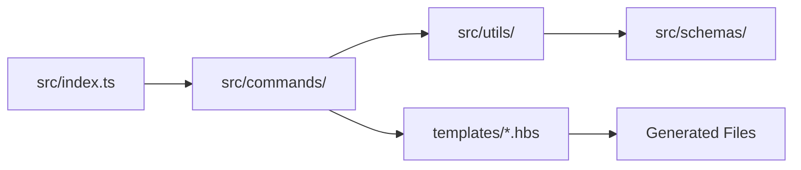
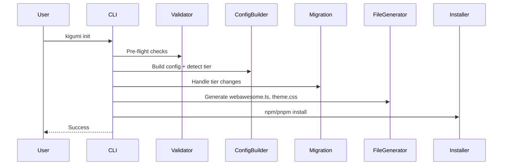

# Kigumi CLI - AI Agent Guide

> **shadcn/ui for Web Awesome** - Template-based CLI for React/Vue/Svelte wrappers around Web Awesome components.

**Version**: 0.2.0 | **Stack**: TypeScript, Commander, Handlebars, Zod

## Quick Start

```bash
pnpm build              # Build CLI + copy templates
pnpm test               # Run unit tests
pnpm lint && pnpm type-check  # Verify code quality
```

**Test the CLI:**

```bash
node dist/index.js init --framework=react --theme=awesome --yes
node dist/index.js add button --overwrite
```

## Repository Structure

See [repo-structure.mmd](repo-structure.mmd) for visual diagram.

| Directory    | Purpose              | Local AGENTS.md                            |
| ------------ | -------------------- | ------------------------------------------ |
| `src/`       | CLI source code      | [src/AGENTS.md](src/AGENTS.md)             |
| `templates/` | Handlebars templates | [templates/AGENTS.md](templates/AGENTS.md) |
| `tests/`     | Unit & E2E tests     | [tests/AGENTS.md](tests/AGENTS.md)         |
| `dist/`      | Build output         | -                                          |

**Key Files:**
| File | Purpose |
|------|---------|
| `src/index.ts` | CLI entry point (Commander routing) |
| `src/utils/registry.ts` | Component definitions (single source of truth) |
| `src/utils/tier.ts` | Free/Pro tier detection from `package.json` + `.env` |
| `src/commands/init/` | Project initialization |
| `src/commands/add.ts` | Component installation |

---

## Critical Rules

### 1. Templates-First Development

**NEVER edit generated code. ALWAYS update `.hbs` templates.**

```
Edit .hbs → pnpm build → node dist/index.js add {component} --overwrite → Test
```

- TypeScript: `.tsx.hbs` (with interfaces)
- JavaScript: `.jsx.hbs` (with JSDoc)
- See [templates/AGENTS.md](templates/AGENTS.md) for patterns

### 2. React Import Patterns

> **Why different?** TypeScript benefits from tree-shaking with named imports. JavaScript uses default import for broader compatibility with older bundlers.

**TypeScript (.tsx):** Use named imports

```typescript
import { forwardRef, useState, type HTMLAttributes } from 'react';
```

**JavaScript (.jsx):** Use default import + destructure

```javascript
import React from 'react';
const { useState } = React;
```

### 3. Web Components Use `class`, NOT `className`

```typescript
// Correct
<wa-button class={clsx('Button', className)}>

// Wrong - doesn't work
<wa-button className={className}>
```

### 4. TypeScript Declarations: Use `declare global`

**NEVER use `declare module 'react'`** - it overwrites React exports!

```typescript
// WRONG - breaks React
declare module 'react' {
  namespace JSX { ... }
}

// CORRECT - extends without breaking
declare global {
  namespace JSX {
    interface IntrinsicElements {
      'wa-button': React.DetailedHTMLProps<React.HTMLAttributes<HTMLElement>, HTMLElement>;
    }
  }
}
export {};
```

### 5. Event Listeners in useEffect (with cleanup)

```typescript
useEffect(() => {
  const el = ref.current;
  if (!el) return;
  el.addEventListener('wa-show', handleShow);
  return () => el.removeEventListener('wa-show', handleShow);
}, [onShow]);
```

### 6. Web Component Registration

Components must be imported in `src/lib/webawesome.ts`:

```typescript
import '@awesome.me/webawesome/dist/components/button/button.js';
```

Auto-managed by `updateWebAwesomeImports()` in `src/commands/add.ts`.

### 7. Dialog API: `requestClose()` not `hide()`

```typescript
hide: () => dialogRef.current?.requestClose(),
requestClose: () => dialogRef.current?.requestClose(),
```

---

## Tier System

**Single source of truth:** `.env` file determines tier, NOT config.

| Tier | Detection                        | Package                      | Themes    |
| ---- | -------------------------------- | ---------------------------- | --------- |
| Free | No token in `.env`               | `@awesome.me/webawesome`     | 3 themes  |
| Pro  | `WEBAWESOME_NPM_TOKEN` in `.env` | `@awesome.me/webawesome-pro` | 11 themes |

**Pro-only components:** page, charts, combobox, data-grid, date-picker, file-input, toast, video

### Tier Detection Logic

```typescript
// src/utils/tier.ts - Detects tier with package.json priority
async function detectTier(cwd: string): Promise<Tier> {
  // 1. Check package.json first (installed package is source of truth)
  const pkg = await fs.readJSON('package.json');
  if (pkg.dependencies?.['@awesome.me/webawesome-pro']) return 'pro';
  if (pkg.dependencies?.['@awesome.me/webawesome']) return 'free';

  // 2. Fallback to token detection (.env or ~/.npmrc)
  const token = await detectProToken(cwd);
  return token ? 'pro' : 'free';
}
```

**Detection priority:**

1. `package.json` dependencies (highest priority - actual installed package)
2. `.env` file (`WEBAWESOME_NPM_TOKEN`)
3. Global `~/.npmrc` token
4. Default to `free` if none found

### Migration Triggers

| Previous | New  | Action                                     |
| -------- | ---- | ------------------------------------------ |
| free     | pro  | Migrate imports to `-pro`, update `.npmrc` |
| pro      | free | Reverse migrate imports, update `.npmrc`   |

**Critical files:** `src/commands/init/migration.ts`, `src/commands/init/installer.ts`

---

## Code Quality (Zero Tolerance)

Pre-commit hooks enforce all checks. **All must pass before commit:**

```bash
pnpm lint          # ESLint: 0 problems
pnpm type-check    # TypeScript: 0 errors
pnpm format:check  # Prettier: all formatted
pnpm test          # Vitest: all passing
```

**Auto-fix:** `pnpm lint:fix && pnpm format`

---

## Architecture

### Data Flow



### Module Boundaries

| Layer    | Directory       | Responsibility                          |
| -------- | --------------- | --------------------------------------- |
| Entry    | `src/index.ts`  | CLI routing, error handling             |
| Commands | `src/commands/` | User-facing operations                  |
| Utils    | `src/utils/`    | Business logic (registry, tier, config) |
| Schemas  | `src/schemas/`  | Zod validation                          |
| Errors   | `src/errors/`   | Typed error classes                     |
| Output   | `src/output/`   | Console formatting (@clack/prompts)     |

### Init Command Flow



---

## Debugging

| Problem             | Check                       | Fix                                 |
| ------------------- | --------------------------- | ----------------------------------- |
| Components unstyled | `webawesome.ts` imports?    | Run `updateWebAwesomeImports()`     |
| TypeScript errors   | `declare module 'react'`?   | Use `declare global` instead        |
| wa-\* type errors   | `vite-env.d.ts` exists?     | Run `generateViteEnvDts()`          |
| Theme not applying  | CSS imported? HTML classes? | Check `webawesome.ts` imports       |
| Theme conflicts     | Duplicate theme imports?    | Verify `theme.css` has no `@import` |
| Tier wrong          | `.env` has token?           | Use `detectTier()`                  |
| Free→Pro fails      | Migration ran?              | Check `migration.ts`                |
| Wrong import paths  | Mixed free/pro imports?     | Run `kigumi doctor`                 |
| JSON parse fails    | File has comments?          | Use `readJSONWithComments()`        |

---

## Common Mistakes

1. Editing generated code instead of `.hbs` templates
2. Using `className` on `<wa-*>` elements (use `class`)
3. Using `declare module 'react'` (use `declare global`)
4. Event listeners in ref callback (use `useEffect`)
5. Using `fs.readJSON()` on files with comments
6. Storing tier in config (detect from `.env`)
7. Using `any` type (use `unknown` or proper types)
8. **Using `!important` to override Web Awesome styles** (use CSS layers - `theme.css` automatically overrides base)
9. **Manually editing `layers.css` or `webawesome.ts`** (auto-generated - use `kigumi theme` commands)
10. **Adding Web Awesome imports to `theme.css`** (all imports handled in `layers.css`)
11. Making assumptions - ask for help if unsure

---

## Auto-Generated Files

| File                    | Purpose                                                  | Regenerated When             | User-Editable      |
| ----------------------- | -------------------------------------------------------- | ---------------------------- | ------------------ |
| `src/lib/webawesome.ts` | Imports layers.css and applies theme classes to `<html>` | Theme/brand/palette commands | ❌ No              |
| `src/styles/layers.css` | Wraps Web Awesome CSS in cascade layers                  | Theme/brand/palette commands | ❌ No              |
| `src/styles/theme.css`  | User custom CSS overrides                                | Only on init (if missing)    | ✅ Yes - preserved |
| `src/vite-env.d.ts`     | TypeScript declarations for wa-\* elements               | Only on init                 | ❌ No              |
| `.npmrc`                | npm registry configuration                               | Init + tier changes          | ❌ No              |

**Key Points:**

- `layers.css` uses CSS `@layer` for cascade control (base < theme)
- `theme.css` is preserved on re-init - existing user styles won't be overwritten
- Theme/brand commands regenerate `webawesome.ts` + `layers.css` but preserve `theme.css`

---

## Questions Before Changes

1. Does this need `.hbs` template changes?
2. Works with React 18 AND 19?
3. Tier restrictions correct?
4. TypeScript errors for users?
5. Web components need imports?
6. Event listeners cleaned up?
7. Tested in browser?

---

## Related Documentation

- **Templates:** [templates/AGENTS.md](templates/AGENTS.md) - Component generation patterns
- **Source:** [src/AGENTS.md](src/AGENTS.md) - Code architecture details
- **Tests:** [tests/AGENTS.md](tests/AGENTS.md) - Testing guidelines
- **Cursor Skills:** [.cursor/SKILLS.md](.cursor/SKILLS.md) - Automated component generation
- **Changelog:** Generated via changesets (coming soon)

---

**Maintained by:** AI Assistants | **Last Updated:** 2026-02-09
