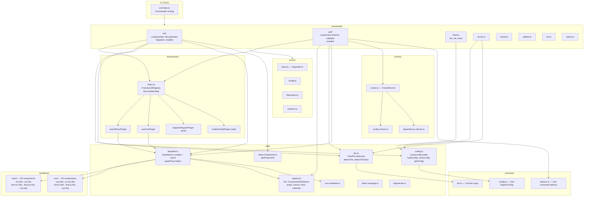
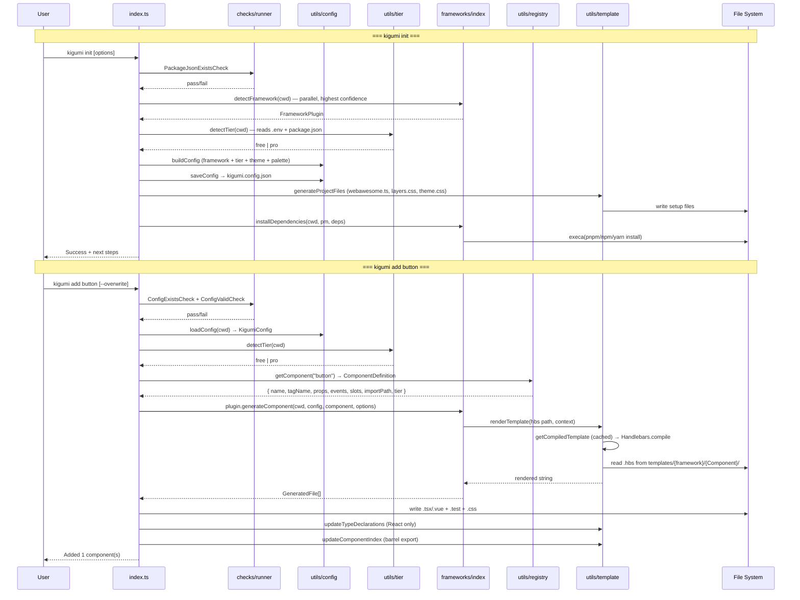
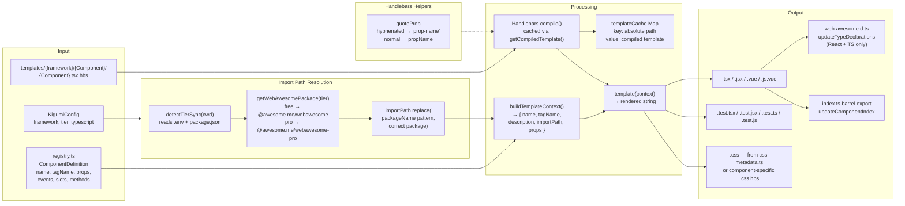
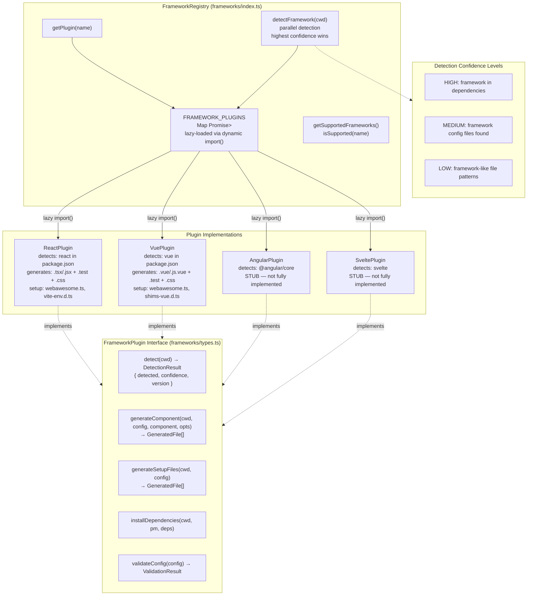

# Kigumi CLI

> **shadcn/ui for Web Awesome** — Template-based CLI that generates React/Vue/Svelte/Angular wrappers around Web Awesome web components.

For detailed rules and checklists, see [AGENTS.md](AGENTS.md).

## Quality Checks (Stop Hook)

A stop hook at `.claude/hooks/stop-quality-check.sh` runs automatically after each response when source files changed. It runs: type-check → lint → validate:changes → validate:registry → validate:templates → unit tests. Only checks relevant to changed files are triggered. If any check fails, you will be blocked from stopping and must fix the errors first.

## Architecture Overview

## Command Flows

## Template Pipeline

## Framework Plugin System

