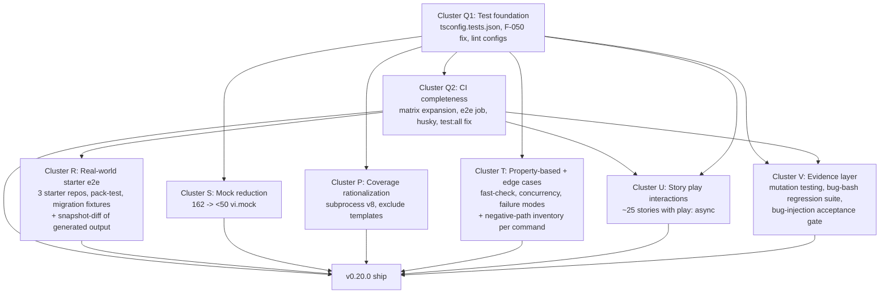

# Test Infrastructure Hardening — Initiative Overview

> Bring the kigumi-cli test surface from "green CI by assumption" to "green CI by demonstrated evidence" before v0.20.0 ships.

**Type:** Multi-cluster initiative (8 clusters, multiple PRs)
**Status:** Planning
**Codename:** `test-infrastructure-hardening`
**Author:** Mischa
**Created:** 2026-04-28
**Target:** v0.20.0 ships against the new safety net

## Overview

The architectural review of the 64+ open F-IDs proposed for v0.20.0 returned ~65% confidence that nothing breaks. The 35% gap is in the **test surface**, not the architectural changes. The verified evidence:

| Gap                                 | Evidence                                                                                                                                                          |
| ----------------------------------- | ----------------------------------------------------------------------------------------------------------------------------------------------------------------- |
| `tests/` is not type-checked        | `tsconfig.json:18` — `include: ["src/**/*"]`. Vitest runs via esbuild without strict checks.                                                                      |
| CI integration matrix is React-only | `.github/workflows/ci.yml:99-100` — `matrix.react-version: ['18', '19']`. Vue and Angular silently absent.                                                        |
| e2e tests never run in CI           | `tests/e2e/{smoke,diff}.test.ts` exist; no workflow invokes `pnpm test:e2e`.                                                                                      |
| Storybook test surface is dead      | `vitest.config.ts:43` — storybookTest `configDir: path.join(dirname, '.storybook')`. Real config lives at `docs/.storybook/`. The project silently fails to load. |
| Stories assert nothing behavioral   | 75 `*.stories.{ts,tsx}` files. `grep -rn 'play:\s*async' docs --include='*.stories.*' \| wc -l` → 0.                                                              |
| Mock theatre dominates unit tests   | `grep -rn 'vi\.mock' tests/unit \| wc -l` → 162 across 26 files. Tests pass against fictional mock behavior.                                                      |
| Visual regression isn't behavioral  | Chromatic snapshots pixels; nothing asserts state transitions, focus moves, or keyboard handling.                                                                 |

A green CI on top of those gaps is a metric, not a guarantee. Without an evidence layer, the rest of the initiative is "we added more tests" without proof those tests catch real breakage. This initiative ships the gaps **and** the evidence that the gaps are closed.

## Goals

1. Every test path that exists locally also runs in CI (no silent skips).
2. Every user-facing command has explicit happy-path **and** negative-path coverage.
3. The starter repos (`kigumi-react`, `kigumi-vue`, `kigumi-angular`) participate in CI as e2e fixtures, packed exactly as a user would install kigumi.
4. The test suite catches **80%+ of mutations** (StrykerJS), 5 of 5 deliberately-injected bugs, and every regression of ≥10 historical bugs.
5. The coverage metric reflects what is actually tested (subprocess instrumentation, no template-artifact denominator inflation).
6. Solo-user rollout: ship 0.20.0 directly when the safety net is green; no rc/prerelease channel.

## Non-Goals

- **Next.js starter coverage in v0.20.0.** `kigumi-next` has no GitHub remote and uses `webawesome-pro` (paid). Bundled `next-app{,-no-src,-pages}` skeletons in `tests/integration/` carry Next.js coverage for now. Push the starter and wire it as own follow-up.
- **Prerelease / rc channel.** Solo-user context; breaking changes are acceptable with upgrade docs.
- **New architectural F-IDs.** Any architectural cluster (A, B, etc.) lands against this safety net, not as part of it.
- **Programmatic CLI invocation refactor (`run(argv)` export).** Speed boost for e2e iteration but adds public API surface. Defer to post-v0.20.0.
- **Cross-editor MCP server.** Already deprioritized in `project-mcp-server-plan` (2nd brain).
- **kigumi-next-starter typecheck script PR.** Out of scope; the 3 GitHub-hosted starters are the matrix participants.

## Cluster Summary

Eight clusters. Each is one PR, one design spec, one working plan, and one update to the status dashboard. Effort estimates assume Sonnet-driven sessions with Opus reserved for design/debugging.

| Cluster | Codename                                                | Primary F-IDs                                   | Depends on                       | Effort  | Acceptance one-liner                                                                                          |
| ------- | ------------------------------------------------------- | ----------------------------------------------- | -------------------------------- | ------- | ------------------------------------------------------------------------------------------------------------- |
| **Q1**  | Test foundation                                         | F-132, F-050, F-052                             | —                                | ~2 days | `pnpm check:tests` exits 0 (or only allowlisted); storybook project loads; lint covers `*.config.{js,ts}`.    |
| **Q2**  | CI completeness                                         | F-046, F-119, F-127, F-051, F-048, F-128, F-045 | Q1                               | ~3 days | Every test path runs in CI; e2e + Vue + Angular lanes green on every PR.                                      |
| **R**   | Real-world starter e2e (+ snapshot diff)                | NEW (F-X1…F-X5)                                 | Q2                               | ~1 week | 3-starter matrix passes against pnpm-packed CLI; byte-level snapshot drift fails CI.                          |
| **S**   | Mock reduction                                          | F-126 (full)                                    | Q1                               | ~1 week | `grep -rn 'vi\.mock' tests/unit \| wc -l` < 50; heaviest file (`theme-commands.test.ts`) < 10.                |
| **P**   | Coverage rationalization                                | F-122+F-124 (pair), F-120, F-123, F-121, F-125  | Q1                               | ~3 days | Coverage gates trustworthy; integration + e2e contribute to the metric.                                       |
| **T**   | Property-based + edge cases (+ negative-path inventory) | NEW (F-X6…F-X9)                                 | Q1, A (for `.strict()` adoption) | ~3 days | fast-check generators for `KigumiConfig`; ≥3 negative-path tests per command, inventory in `tests/AGENTS.md`. |
| **U**   | Story `play()` interactions                             | F-129                                           | Q1, Q2                           | ~3 days | ≥20 stories assert behavior via `play: async`.                                                                |
| **V**   | Evidence layer                                          | NEW (mutation, bug-bash, bug-injection)         | Q1, Q2                           | ~3 days | Mutation score ≥ 80%; ≥10 regression tests for historical bugs; 5/5 bug-injection.                            |

The R extension (snapshot-diff of generated output) and T extension (negative-path inventory) are folded into their respective cluster specs at write-time, not as separate clusters.

## Cluster Dependency Graph

Q1 is single-blocker. After Q1 ships, S/P/T are independent and parallelizable across sessions. R waits on Q2 (e2e workflow plumbing). U waits on Q1 + Q2. V waits on Q1 + Q2 — mutation testing must run against typed tests, and the bug-injection gate is a final acceptance step.

## Why Cluster V — the Evidence Layer

Without V, this initiative is a refactor of the existing test surface. Tests get type-checked (Q1), more frameworks run in CI (Q2 + R), more stories assert behavior (U), and mocks decrease (S). All true. None of those _prove_ the assertions catch real breakage.

V provides three forms of evidence:

1. **Objective metric** — StrykerJS mutates `src/**` (flips `<` to `>`, swaps `&&` for `||`, removes early returns) and runs the full suite per mutant. The percentage of mutants killed by _any_ test = mutation score. ≥80% kill rate is the gate.
2. **Historical proof** — A `tests/regression/` directory with ≥10 regression tests, each protecting a documented past bug. Verified during cluster execution by `git revert`-ing each historical fix on a scratch branch and confirming the regression test fails.
3. **One-time acceptance gate** — At end of cluster: plant 5 deliberate bugs (typo in default value, off-by-one, swap `&&`/`||`, return-early, wrong filename in template generator). Run full suite. Required: 5/5 mutants killed by tests as written.

The combination turns "tests pass" into "tests demonstrably catch breakage."

## Working Pattern (one cluster per session)

Each cluster gets a dedicated session. The session is bounded so context fits with room to spare. The end-of-session checklist below is the contract every cluster session honors.

### Session start

1. Read this initiative doc (you're here).
2. Read the status dashboard at `docs/superpowers/state/test-infrastructure-hardening-status.md`. It tells you which clusters are unblocked.
3. Pick the next unblocked cluster (lowest dependency depth).
4. Read that cluster's spec at `docs/superpowers/specs/2026-04-XX-cluster-<id>-<topic>-design.md`.
5. (Optional) Read the most recent prior cluster's session note in 2nd brain (`project-test-infra-cluster-<id>-notes.md`) for surprises that might apply.

### Session execution

6. Write the cluster's working plan at `.claude/plans/2026-04-XX-cluster-<id>-plan.md` (gitignored per CLAUDE.md). The plan is the actionable execution doc; the spec is the design.
7. Execute the plan, phase by phase. Validate at each phase gate using the cluster's `Verification` section.
8. Open a draft PR early; mark Ready for Review when CI is green.

### Session end

9. Update `state/test-infrastructure-hardening-status.md`: move the cluster's row from IN-PROGRESS → SHIPPED, add the PR link.
10. (Optional) Append an entry to the local 2nd-brain decisions log if a non-obvious decision was made; append to learnings if a generalizable pattern emerged; write `project-test-infra-cluster-<id>-notes.md` if there are session surprises worth preserving.
11. (Optional) Mark the cluster's F-IDs as DONE-PR-#xxx in `~/.claude/projects/kigumi-cli-overview.md`.

### Why this works

- One cluster per session = bounded scope = context fits.
- The status dashboard answers "where are we" without re-reading every spec.
- The 2nd-brain layer (recommended below) accumulates decisions and learnings without bloating the repo.
- Cross-cluster dependencies are explicit in the graph, not inferred.

## 2nd Brain Layer (Recommended Local Follow-up)

The repo holds **stable design** (this doc, cluster specs) and **operational state** (the status dashboard). The user's 2nd brain at `~/.claude/projects/-Users-giregar-Documents-dev-git-kigumi-cli/memory/` should additionally hold **decisions, learnings, and per-cluster session notes** that change as the initiative progresses.

This PR does **not** create those files because the remote planning environment that authored this initiative cannot write to `~/.claude/projects/`. The user seeds them locally after this PR merges:

| File                                       | Role                                                                 | When to write                                                                                                             |
| ------------------------------------------ | -------------------------------------------------------------------- | ------------------------------------------------------------------------------------------------------------------------- |
| `project-test-infrastructure-hardening.md` | Master dashboard mirror (private, complements the public state file) | At PR merge; updated end-of-session                                                                                       |
| `project-test-infra-decisions.md`          | Chronological decisions log                                          | When a non-obvious decision is made; entry format `## YYYY-MM-DD: topic` + Decision / Why / How to apply                  |
| `feedback-test-infra-patterns.md`          | Cross-cluster learnings                                              | When a pattern emerges that applies beyond the cluster that found it; entry format follows existing `feedback-*.md` files |
| `project-test-infra-cluster-<id>-notes.md` | Per-cluster session note (optional)                                  | At cluster shipping if there are surprises worth preserving                                                               |

### Why this 4-file shape

Splitting decisions/learnings/dashboard into separate files keeps each one scannable and findable by name. Mixing decisions and learnings hides them from each other (decisions are timestamped; learnings are timeless rules). Per-cluster notes are sparse — embedding them in the dashboard buries them.

### F-ID Registration (Local Follow-up)

The new F-IDs introduced by this initiative cannot be registered in this PR — `kigumi-cli-overview.md` lives in 2nd brain, not in the repo. The user adds them locally after merge with the cluster ownership tagged below:

- **Cluster R F-IDs** (5):
  - F-X1: Add `typecheck` script to `kigumi-react`, `kigumi-vue`, `kigumi-angular` starters (3 separate small PRs to those repos).
  - F-X2: Pin starter commits in kigumi-cli CI for determinism (workflow vars `STARTER_REACT_REF`, `STARTER_VUE_REF`, `STARTER_ANGULAR_REF`).
  - F-X3: Starter e2e CI matrix (clones each starter, packs CLI tarball, links via tarball, runs `init` + `add` + `build`).
  - F-X4: Pack-test job (`pnpm pack` → install tarball into temp project → smoke run).
  - F-X5: Migration fixture suite (`0.18.x-config.json` and `0.19.x-config.json` realistic fixtures, assert `kigumi upgrade` clean output).
- **Cluster T F-IDs** (4):
  - F-X6: fast-check generators for `KigumiConfig` (every field, including `.strict()` rejection path; round-trip `parse(stringify(generate())) == generate()`).
  - F-X7: Corrupt-config edge case suite (partial mid-write, malformed JSON, BOM, trailing comma, wrong types).
  - F-X8: Concurrency tests (multiple `kigumi add` invocations on same project; assert no torn writes; document locking semantics).
  - F-X9: Failure-mode tests (disk-full, permission-denied on `src/components/ui/`, network failures, GitHub API 403/429).
- **Cluster V F-IDs** (3):
  - F-X10: Mutation testing via StrykerJS, weekly CI workflow, score ≥ 80% gate.
  - F-X11: Bug-bash regression suite in `tests/regression/`, ≥ 10 historical bugs each documenting the protected PR/F-ID.
  - F-X12: Bug-injection acceptance gate runbook (`scripts/bug-injection-gate.md`), 5/5 kill rate as final acceptance step before initiative SHIPPED.

## Initiative-Level Acceptance Criteria

The initiative is declared SHIPPED when **all** of the following hold simultaneously:

1. `pnpm check:tests` exists in `package.json` and exits 0 (or only against an allowlisted baseline that shrinks each PR). (Q1)
2. CI runs unit + integration + e2e + storybook + 3-starter matrix on every PR; the corresponding GitHub Actions jobs are green on the v0.20.0 release commit. (Q2 + R + U)
3. `grep -rn 'vi\.mock' tests/unit | wc -l` < 50; `theme-commands.test.ts` < 10. (S)
4. Coverage gates in `vitest.unit.config.ts` reflect tested behavior; integration + e2e contribute to the v8 metric (subprocess instrumentation works). (P)
5. `tests/unit/schemas/config-property.test.ts` (or equivalent) runs fast-check in CI with a pinned seed. (T)
6. ≥ 20 stories under `docs/src/stories/**` have `play: async` functions. (U)
7. Mutation score ≥ 80% on `src/**` per StrykerJS. (V)
8. ≥ 10 bug-bash regression tests in `tests/regression/`, each documenting the historical PR/F-ID it protects (verified by reverting the original fix on a scratch branch and confirming the regression test fails). (V)
9. Bug-injection acceptance gate: 5 deliberate bugs planted in `src/`, kill rate must be 5/5 before initiative declared SHIPPED. (V)
10. Snapshot-diff of every generated file across the 3-starter × broad-component scenario is committed to `tests/fixtures/starter-snapshots/`; any byte-level drift fails CI without an explicit `--update` commit. (R extension)
11. Every user-facing command has ≥ 3 negative-path tests (malformed config, missing target, conflicting/invalid options). Explicit inventory committed to `tests/AGENTS.md`. (T extension)
12. The status dashboard at `docs/superpowers/state/test-infrastructure-hardening-status.md` shows all 8 clusters SHIPPED with PR links.

When all 12 hold, the v0.20.0 architectural changes ship against the new safety net. Confidence that nothing breaks moves from ~65% (assumed) to ≥99% (demonstrated).

## Risks & Mitigations

| Risk                                                                                       | Mitigation                                                                                                                                                                                                                |
| ------------------------------------------------------------------------------------------ | ------------------------------------------------------------------------------------------------------------------------------------------------------------------------------------------------------------------------- |
| Initiative scope creeps as new F-IDs land in `kigumi-cli-overview.md` mid-execution.       | Initiative scope is frozen at the 8-cluster table above. New F-IDs go into existing or new clusters but the initiative does not expand mid-flight. Defer to a follow-up initiative if scope drifts.                       |
| Solo-user assumption flips (kigumi gains real users mid-initiative).                       | Reopen this doc, add a "Release strategy" section, decide if a prerelease/staged-rollout is now warranted before shipping the next cluster.                                                                               |
| Cluster Q1 fix of 132 tests/-type errors is too big for one PR.                            | Q1 spec adopts the hybrid approach: land `tsconfig.tests.json` + `pnpm check:tests` script first with a baseline allowlist of the existing 132 errors, then chunk fixes across follow-up sub-PRs within the cluster.      |
| Status dashboard becomes stale (sessions forget to update it).                             | Working-pattern step 9 is non-optional. If a dashboard update is missed, the next session catches it before picking work.                                                                                                 |
| Cluster T fast-check tests are flaky in CI.                                                | Pin a fixed seed via `fc.configureGlobal({ seed: 1 })` in CI; randomize locally for discovery. Documented in T's spec.                                                                                                    |
| Cluster S mock reduction silently regresses test correctness.                              | S spec mandates: every refactored test file's PR description includes `git diff` of the test + before/after mock count; reviewer (or self-review) confirms assertions still test the same thing, just with real fixtures. |
| Mutation testing runtime cost too high for every PR.                                       | Schedule weekly + `workflow_dispatch`. Score is a regression gate (week-over-week), not a per-PR check.                                                                                                                   |
| Bug-bash regression list goes stale (bugs from old PRs not the kind we're shipping today). | Re-curate the list each minor release; remove obsolete entries, add new ones from recent PRs. Cluster V's spec specifies the curation procedure.                                                                          |
| Cluster R starter-repo participation breaks if a starter regresses unrelated to kigumi.    | R spec pins each starter to a specific commit (`vars.STARTER_*_REF`); deliberate bumps are explicit PRs to update the var.                                                                                                |

## Glossary

- **Cluster** — a coherent group of F-IDs and/or new work items shipped as one PR with one design spec.
- **Initiative** — a multi-cluster effort with a single goal (here: bulletproof test infrastructure for v0.20.0).
- **F-ID** — finding ID in the canonical backlog at `~/.claude/projects/kigumi-cli-overview.md` (2nd brain).
- **Bug-bash regression test** — a test in `tests/regression/` that protects against the recurrence of a specific past bug; documented with PR/F-ID link.
- **Bug-injection acceptance gate** — one-time procedure: plant 5 deliberate bugs, run full suite, require 5/5 kill rate.
- **Mutation score** — percentage of code mutations (StrykerJS) that any test killed.
- **Snapshot-diff** — byte-level comparison of generated CLI output against a committed fixture; any drift fails CI.
- **Starter** — `kigumi-react`, `kigumi-vue`, or `kigumi-angular` (the three GitHub-hosted starter repos under the `kigumi-ui` org).
- **2nd brain** — user's local memory directory at `~/.claude/projects/-Users-giregar-Documents-dev-git-kigumi-cli/memory/`.

## Links

- **Status dashboard:** [`docs/superpowers/state/test-infrastructure-hardening-status.md`](../state/test-infrastructure-hardening-status.md)
- **Cluster Q1 spec:** [`docs/superpowers/specs/2026-04-29-cluster-q1-test-foundation-design.md`](../specs/2026-04-29-cluster-q1-test-foundation-design.md)
- **Cluster V spec:** [`docs/superpowers/specs/2026-04-29-cluster-v-evidence-layer-design.md`](../specs/2026-04-29-cluster-v-evidence-layer-design.md)
- **Spec format reference:** [`docs/superpowers/specs/2026-04-25-template-typecheck-coverage-design.md`](../specs/2026-04-25-template-typecheck-coverage-design.md)
- **State format reference:** [`docs/superpowers/state/foundations-restructure-status.md`](../state/foundations-restructure-status.md)
- **CLAUDE.md:** [`CLAUDE.md`](../../../CLAUDE.md) — agent rules; specifically the working-plans-go-in-`.claude/plans/` rule.
- **AGENTS.md:** [`AGENTS.md`](../../../AGENTS.md) — repo conventions, commands, and checklists.
